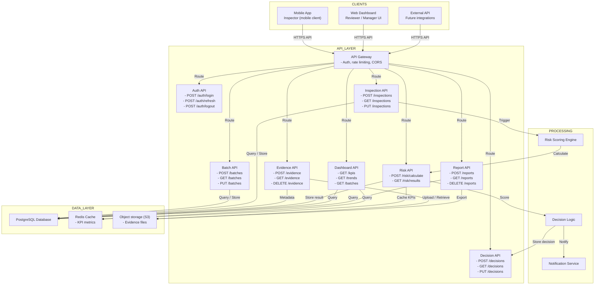

# API Interactions Diagram

## Overview

This diagram shows how the major system components communicate via APIs: the backend API, mobile app, web dashboard, and external systems.

## API Interaction Architecture



## API Endpoints by Domain

### Authentication API

**Endpoint:** `/api/v1/auth/`

```
POST /auth/login
  Request: { username, password }
  Response: { access_token, refresh_token, user }
  
POST /auth/refresh
  Request: { refresh_token }
  Response: { access_token }
  
POST /auth/logout
  Request: { refresh_token }
  Response: { success: true }
```

### Batch Management API

**Endpoint:** `/api/v1/batches/`

```
POST /batches/
  Create new batch
  Request: { lot_number, supplier_id, product_id, quantity, received_date }
  Response: { id, status, batch_number, supplier, product }
  
GET /batches/
  List batches with filtering
  Params: status, supplier_id, product_id, date_range
  Response: [ { id, status, batch_number, supplier, received_date } ]
  
GET /batches/{id}/
  Get batch details
  Response: { id, status, lot_number, supplier, product, evidence, decisions }
  
PUT /batches/{id}/
  Update batch (admin only)
  Request: { status, notes }
  Response: { id, status, updated_at }
```

### Inspection API

**Endpoint:** `/api/v1/inspections/`

```
POST /inspections/
  Create inspection for batch
  Request: { batch_id, inspector_id }
  Response: { id, batch_id, status: "draft", inspector_id }
  
GET /inspections/
  List inspections for user
  Params: status, assigned_to, batch_id
  Response: [ { id, batch_id, status, inspector, received_date } ]
  
GET /inspections/{id}/
  Get inspection details
  Response: { id, batch_id, status, evidence, risk_score, decision }
  
PUT /inspections/{id}/
  Update inspection status
  Request: { status, notes }
  Response: { id, status, updated_at }
```

### Evidence API

**Endpoint:** `/api/v1/evidence/`

```
POST /evidence/
  Upload evidence file
  Request: multipart/form-data { inspection_id, file, description }
  Response: { id, inspection_id, url, type, uploaded_at }
  
GET /evidence/
  List evidence for inspection
  Params: inspection_id
  Response: [ { id, url, description, type, uploaded_at } ]
  
GET /evidence/{id}/
  Get evidence details
  Response: { id, inspection_id, url, type, metadata }
  
DELETE /evidence/{id}/
  Delete evidence (admin only)
  Response: { success: true }
```

### Risk Scoring API

**Endpoint:** `/api/v1/risk/`

```
POST /risk/calculate/
  Trigger risk calculation
  Request: { batch_id }
  Response: { score, factors, recommendation }
  
GET /risk/results/
  List risk results
  Params: batch_id, date_range
  Response: [ { batch_id, score, recommendation, created_at } ]
  
GET /risk/results/{id}/
  Get detailed risk calculation
  Response: { score, condition_score, anomaly_score, supplier_score, product_score }
```

### Decision API

**Endpoint:** `/api/v1/decisions/`

```
POST /decisions/
  Make decision on batch
  Request: { batch_id, decision: "accept|isolate|escalate", notes }
  Response: { id, batch_id, decision, reviewer_id, timestamp }
  
GET /decisions/
  List decisions
  Params: batch_id, decision, date_range
  Response: [ { id, batch_id, decision, reviewer, timestamp } ]
  
GET /decisions/{id}/
  Get decision details
  Response: { id, batch_id, decision, reviewer, notes, timestamp, audit_log }
```

### Dashboard API

**Endpoint:** `/api/v1/dashboard/`

```
GET /dashboard/kpis/
  Get KPI metrics
  Params: date_range, site_id
  Response: { 
    total_batches, 
    accepted_count, 
    rejected_count, 
    escalated_count,
    acceptance_rate,
    average_risk_score
  }
  
GET /dashboard/queue/
  Get review queue
  Params: status, priority
  Response: [ { id, batch_id, risk_score, created_at, assigned_to } ]
  
GET /dashboard/trends/
  Get trends over time
  Params: date_range
  Response: {
    daily_batches,
    daily_acceptance_rate,
    top_suppliers,
    top_products
  }
```

### Reporting API

**Endpoint:** `/api/v1/reports/`

```
POST /reports/
  Generate report
  Request: { report_type: "compliance|summary|detailed", date_range }
  Response: { id, status: "processing", download_url }
  
GET /reports/
  List available reports
  Response: [ { id, type, generated_at, size } ]
  
GET /reports/{id}/
  Download report
  Response: File (PDF/CSV)
  
DELETE /reports/{id}/
  Delete report (admin)
  Response: { success: true }
```

---

## Typical API Flows

### Flow 1: Inspector Inspection (Mobile App)

```
1. POST /auth/login
   Mobile app → API Gateway → Auth API
   Response: { access_token, user }
   
2. GET /inspections/?assigned_to=me
   Mobile app → API Gateway → Inspection API
   Response: [ { id, batch_id, status } ]
   
3. PUT /inspections/{id}/
   Mobile app → API Gateway → Inspection API (start field work)
   Request: { status: "under_inspection" }
   Response: { id, status }
   
4. POST /evidence/
   Mobile app → API Gateway → Evidence API (upload photo)
   Request: multipart { inspection_id, file }
   Response: { id, url }
   
5. PUT /inspections/{id}/
   Mobile app → API Gateway → Inspection API (submit)
   Request: { status: "evidence_captured", batch_data: {...} }
   Response: { id, status }
   
6. GET /inspections/{id}/
   Mobile app → API Gateway → Inspection API (view risk)
   Response: { id, risk_score, recommendation }
```

### Flow 2: Reviewer Decision (Web Dashboard)

```
1. POST /auth/login
   Web app → API Gateway → Auth API
   Response: { access_token, user }
   
2. GET /dashboard/queue/
   Web app → API Gateway → Dashboard API
   Response: [ { id, batch_id, risk_score, created_at } ]
   
3. GET /inspections/{id}/
   Web app → API Gateway → Inspection API (view batch)
   Response: { id, batch_id, evidence, risk_score }
   
4. GET /evidence/?inspection_id={id}
   Web app → API Gateway → Evidence API (view photos)
   Response: [ { id, url, description } ]
   
5. POST /decisions/
   Web app → API Gateway → Decision API (submit decision)
   Request: { batch_id, decision: "accept", notes }
   Response: { id, batch_id, decision, timestamp }
   
6. GET /dashboard/kpis/
   Web app → API Gateway → Dashboard API (refresh KPI)
   Response: { total_batches, acceptance_rate, etc }
```

### Flow 3: Auto Risk Scoring (Backend)

```
1. Inspection submitted via API
   
2. Backend triggers:
   POST /risk/calculate/ (internal)
   Request: { batch_id }
   
3. Risk Engine:
   - Fetches batch data from Database
   - Fetches product info from Database
   - Fetches supplier history from Database
   - Calculates score
   
4. Decision Logic:
   - Evaluates score
   - Routes to appropriate state
   - Triggers notification if needed
   
5. Updates Database:
   - Stores RiskResult
   - Updates BatchInspection status
   - Creates AuditLog entry
   
6. If review needed:
   - Notifies reviewer via NotificationService
   - Updates review queue in Dashboard API
```

---

## Error Handling

### HTTP Status Codes

```
200 OK - Success
201 Created - Resource created
204 No Content - Success, no response body
400 Bad Request - Invalid input
401 Unauthorized - Missing/invalid auth
403 Forbidden - No permission
404 Not Found - Resource doesn't exist
409 Conflict - Invalid state transition
429 Too Many Requests - Rate limit exceeded
500 Internal Server Error - Unexpected error
503 Service Unavailable - Temporary outage
```

### Error Response Format

```json
{
  "error": "invalid_decision",
  "message": "Cannot escalate a batch that has already been accepted",
  "code": "STATE_CONFLICT",
  "timestamp": "2026-05-19T14:45:00Z"
}
```

---

## Performance Considerations

### Caching Strategy
- KPI metrics cached for 5 minutes
- Product/supplier data cached for 1 hour
- User permissions cached per session
- Evidence URLs cached with signed cookie

### Rate Limiting
- 100 requests per minute per user
- 1000 requests per minute per API key (external)
- Batch upload: 50MB per request

### Optimization
- Pagination on list endpoints (default 20, max 100)
- Lazy load evidence photos (thumbnails first)
- Async job for report generation
- Batch operations for KPI updates

---

## Authentication & Authorization

### Token-Based (JWT)

```
Header: Authorization: Bearer {access_token}

access_token: 24 hour expiry
refresh_token: 7 day expiry

Payload:
{
  "sub": "user_id",
  "role": "inspector|reviewer|admin",
  "org_id": "org_id",
  "site_id": "site_id",
  "exp": 1234567890
}
```

### Permission Examples

```
Inspector can:
- POST /inspections/ (create)
- PUT /inspections/{id}/ (update own)
- POST /evidence/ (upload)
- GET /inspections/{id}/ (view own)

Reviewer can:
- GET /inspections/ (all in org)
- POST /decisions/ (make)
- GET /decisions/ (view)
- GET /dashboard/queue/

Admin can:
- All endpoints
- POST /users/
- DELETE /evidence/
- PUT /rules/
```

---

## Next Steps

See:
1. [API Endpoints Detailed](api-endpoints.md) - Complete endpoint specifications
2. [Sequence Diagrams](../sequences/) - Timing and ordering of API calls
3. [Database Schema](../data-model/database-schema.md) - Underlying data structures

---

**Key Insight:** All interaction between clients and backend flows through RESTful APIs with clear request/response contracts, consistent error handling, and role-based access control.
