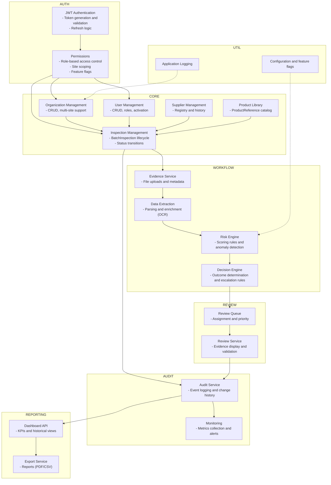

# C4 Component Diagram (Backend)

## Overview

Backend component view showing responsibilities and internal services implemented in the Django application.

```mermaid
graph TB
    subgraph AUTH
        JWT["JWT Authentication\n- Token generation and validation\n- Refresh logic"]
        Permissions["Permissions\n- Role-based access control\n- Site scoping\n- Feature flags"]
    end

    subgraph CORE
        OrgMgmt["Organization Management\n- CRUD, multi-site support"]
        UserMgmt["User Management\n- CRUD, roles, activation"]
        InspectionMgmt["Inspection Management\n- BatchInspection lifecycle\n- Status transitions"]
        SupplierMgmt["Supplier Management\n- Registry and history"]
        ProductLib["Product Library\n- ProductReference catalog"]
    end

    subgraph WORKFLOW
        EvidenceService["Evidence Service\n- File uploads and metadata"]
        DataExtraction["Data Extraction\n- Parsing and enrichment (OCR)"]
        RiskEngine["Risk Engine\n- Scoring rules and anomaly detection"]
        DecisionEngine["Decision Engine\n- Outcome determination and escalation rules"]
    end

    subgraph REVIEW
        ReviewQueue["Review Queue\n- Assignment and priority"]
        ReviewService["Review Service\n- Evidence display and validation"]
    end

    subgraph AUDIT
        AuditService["Audit Service\n- Event logging and change history"]
        Monitoring["Monitoring\n- Metrics collection and alerts"]
    end

    subgraph REPORTING
        Dashboard["Dashboard API\n- KPIs and historical views"]
        Export["Export Service\n- Reports (PDF/CSV)"]
    end

    subgraph UTIL
        Logging["Application Logging"]
        Config["Configuration and feature flags"]
    end

    JWT --> Permissions
    Permissions --> OrgMgmt
    Permissions --> UserMgmt
    Permissions --> InspectionMgmt

    OrgMgmt --> InspectionMgmt
    UserMgmt --> InspectionMgmt
    SupplierMgmt --> InspectionMgmt
    ProductLib --> InspectionMgmt

    InspectionMgmt --> EvidenceService
    EvidenceService --> DataExtraction
    DataExtraction --> RiskEngine
    RiskEngine --> DecisionEngine

    DecisionEngine --> ReviewQueue
    ReviewQueue --> ReviewService

    InspectionMgmt --> AuditService
    ReviewService --> AuditService

    AuditService --> Monitoring
    AuditService --> Dashboard

    Dashboard --> Export

    Logging -.-> OrgMgmt
    Config -.-> RiskEngine

```
