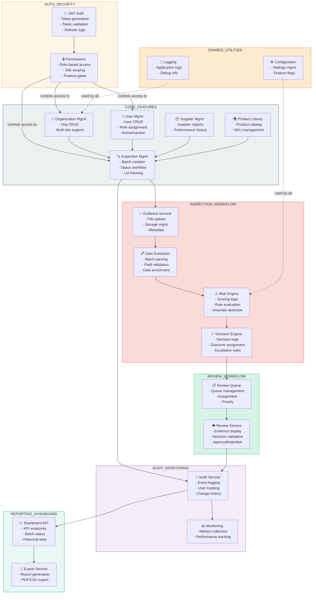

# C4 Component Diagram (Backend)

**Explication courte**
Détail des composants backend Django/DRF : authentification, gestion organisation, inspections, preuve, scoring, décision, revue et audit.

```mermaid
graph TB
    subgraph "AUTH_SECURITY"
        JWT["🔐 JWT Auth<br/>- Token generation<br/>- Token validation<br/>- Refresh logic"]
        Permissions["🔒 Permissions<br/>- Role-based access<br/>- Site scoping<br/>- Feature gates"]
    end
    
    subgraph "CORE_FEATURES"
        OrgMgmt["🏢 Organization Mgmt<br/>- Org CRUD<br/>- Multi-site support"]
        UserMgmt["👥 User Mgmt<br/>- User CRUD<br/>- Role assignment<br/>- Active/inactive"]
        InspectionMgmt["🔍 Inspection Mgmt<br/>- Batch creation<br/>- Status workflow<br/>- Lot tracking"]
        SupplierMgmt["📦 Supplier Mgmt<br/>- Supplier registry<br/>- Performance history"]
        ProductLib["📚 Product Library<br/>- Product catalog<br/>- SKU management"]
    end
    
    subgraph "INSPECTION_WORKFLOW"
        EvidenceService["📸 Evidence Service<br/>- File upload<br/>- Storage mgmt<br/>- Metadata"]
        DataExtraction["🖊️ Data Extraction<br/>- Batch parsing<br/>- Field validation<br/>- Data enrichment"]
        RiskEngine["⚠️ Risk Engine<br/>- Scoring logic<br/>- Rule evaluation<br/>- Anomaly detection"]
        DecisionEngine["✅ Decision Engine<br/>- Decision logic<br/>- Outcome assignment<br/>- Escalation rules"]
    end
    
    subgraph "REVIEW_WORKFLOW"
        ReviewQueue["📋 Review Queue<br/>- Queue management<br/>- Assignment<br/>- Priority"]
        ReviewService["👁️ Review Service<br/>- Evidence display<br/>- Decision validation<br/>- Approval/rejection"]
    end
    
    subgraph "AUDIT_MONITORING"
        AuditService["🔗 Audit Service<br/>- Event logging<br/>- User tracking<br/>- Change history"]
        Monitoring["📊 Monitoring<br/>- Metrics collection<br/>- Performance tracking"]
    end
    
    subgraph "REPORTING_DASHBOARD"
        Dashboard["📈 Dashboard API<br/>- KPI endpoints<br/>- Batch status<br/>- Historical view"]
        Export["📄 Export Service<br/>- Report generation<br/>- PDF/CSV export"]
    end
    
    subgraph "SHARED_UTILITIES"
        Logging["📝 Logging<br/>- Application logs<br/>- Debug info"]
        Config["⚙️ Configuration<br/>- Settings mgmt<br/>- Feature flags"]
    end
    
    JWT --> Permissions
    Permissions -->|controls access to| OrgMgmt
    Permissions -->|controls access to| UserMgmt
    Permissions -->|controls access to| InspectionMgmt
    
    OrgMgmt --> InspectionMgmt
    UserMgmt --> InspectionMgmt
    SupplierMgmt --> InspectionMgmt
    ProductLib --> InspectionMgmt
    
    InspectionMgmt --> EvidenceService
    EvidenceService --> DataExtraction
    DataExtraction --> RiskEngine
    RiskEngine --> DecisionEngine
    
    DecisionEngine --> ReviewQueue
    ReviewQueue --> ReviewService
    
    InspectionMgmt --> AuditService
    ReviewService --> AuditService
    
    AuditService --> Monitoring
    AuditService --> Dashboard
    
    Dashboard --> Export
    
    Logging -.->|used by all| OrgMgmt
    Config -.->|used by all| RiskEngine
    
    style AUTH_SECURITY fill:#fef5e7,stroke:#f39c12
    style CORE_FEATURES fill:#ecf0f1,stroke:#34495e
    style INSPECTION_WORKFLOW fill:#fadbd8,stroke:#e74c3c
    style REVIEW_WORKFLOW fill:#d5f4e6,stroke:#27ae60
    style AUDIT_MONITORING fill:#f4ecf7,stroke:#9b59b6
    style REPORTING_DASHBOARD fill:#e8f8f5,stroke:#16a085
    style SHARED_UTILITIES fill:#fdebd0,stroke:#d68910
```
