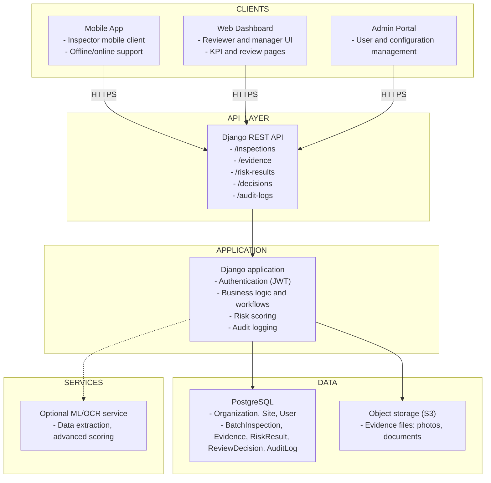

# C4 Container Diagram

## Overview

Container view showing the primary system components: mobile client, web dashboard, API (Django/DRF), storage, and data services.

```mermaid
graph TB
    subgraph CLIENTS
        Mobile["Mobile App\n- Inspector mobile client\n- Offline/online support"]
        Web["Web Dashboard\n- Reviewer and manager UI\n- KPI and review pages"]
        Admin["Admin Portal\n- User and configuration management"]
    end

    subgraph API_LAYER
        API["Django REST API\n- /inspections\n- /evidence\n- /risk-results\n- /decisions\n- /audit-logs"]
    end

    subgraph APPLICATION
        Backend["Django application\n- Authentication (JWT)\n- Business logic and workflows\n- Risk scoring\n- Audit logging"]
    end

    subgraph DATA
        DB["PostgreSQL\n- Organization, Site, User\n- BatchInspection, Evidence, RiskResult, ReviewDecision, AuditLog"]
        Storage["Object storage (S3)\n- Evidence files: photos, documents"]
    end

    subgraph SERVICES
        MLService["Optional ML/OCR service\n- Data extraction, advanced scoring"]
    end

    Mobile -->|HTTPS| API
    Web -->|HTTPS| API
    Admin -->|HTTPS| API

    API --> Backend
    Backend --> DB
    Backend --> Storage
    Backend -.-> MLService

```
