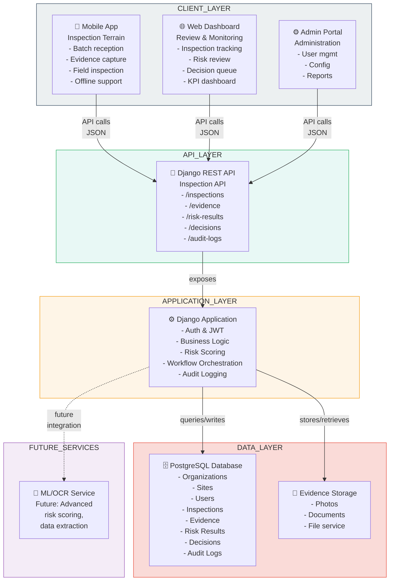

# C4 Container Diagram

**Explication courte**
Vue "container" qui montre les composants principaux du système : mobile, dashboard, API Django DRF, stockage, base de données et services futurs (ML/OCR).

