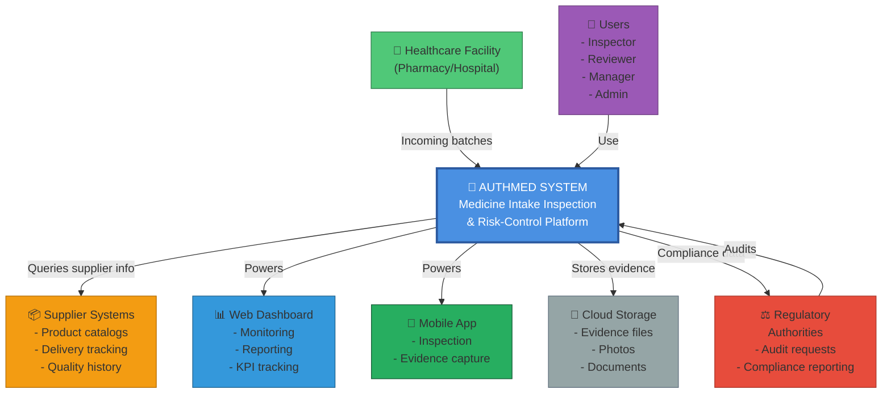

# C4 System Context Diagram

## Overview

The C4 model is a hierarchical approach to system architecture visualization. This document shows the "System Context" level (C1), which depicts the system in relation to external systems and users.

## C4 Context Diagram



## System Scope

**AuthMed** is a **medicine intake inspection and risk-control system** that:
- Manages incoming pharmaceutical batches at healthcare facilities
- Guides inspectors through structured inspection workflows
- Captures evidence (photos, documents, notes)
- Calculates risk scores using rule-based engine
- Routes batches for human review if needed
- Records auditable decisions
- Provides compliance reporting

## External Systems & Users

### Users
**Who:** Inspectors, Reviewers, Managers, Quality Officers, Administrators  
**Interaction:**
- Use mobile app for field inspections
- Use web dashboard for monitoring and decisions
- Consume KPI reports and dashboards

### Healthcare Facilities
**Who:** Pharmacies, hospitals, pharmaceutical receiving centers  
**Interaction:**
- Ship medicine batches to facility
- Receive notifications of batch status
- Retrieve inspection reports
- Manage facilities and users

### Supplier Systems (External)
**Who:** Pharmaceutical manufacturers and distributors  
**Interaction:**
- Provide product information (optional integration)
- Provide supplier quality history (optional integration)
- Receive feedback on rejected batches (future)

### Cloud Storage
**Who:** AWS S3 or equivalent  
**Interaction:**
- Store evidence photos and documents
- Archive inspection files
- Retrieve for audits and recalls

### Web Dashboard
**Who:** Manager, Reviewer, Quality Officer interfaces  
**Interaction:**
- Real-time KPI monitoring
- Batch status tracking
- Report generation
- Decision queue management

### Mobile App
**Who:** Inspector field interface  
**Interaction:**
- Receive inspection assignments
- Capture evidence (photos, videos)
- Enter batch details
- Submit inspections for scoring

### Regulatory Authorities
**Who:** Health ministries, pharmacy boards, accreditation agencies  
**Interaction:**
- Request compliance reports
- Audit batch inspection history
- Verify decision-making process
- Check audit trails

---

## Interactions

### Inbound Flows

1. **Batch Arrival**
   - Facility receives pharmaceutical batch
   - Registers batch in AuthMed
   - System assigns inspector

2. **Field Inspection**
   - Inspector receives mobile notification
   - Inspector captures evidence (photos, notes)
   - Inspector enters batch details
   - Mobile app uploads to AuthMed

3. **Dashboard Access**
   - Manager/Reviewer opens web dashboard
   - Views real-time KPIs and batch queue
   - Makes decisions on pending batches

4. **Audit Request**
   - Regulatory authority requests compliance report
   - AuthMed generates report with audit trail
   - Exports for regulator review

### Outbound Flows

1. **Risk Score Calculation**
   - Batch data analyzed by risk engine
   - Score generated automatically
   - Recommendation created

2. **Decision Queue Update**
   - Pending reviews added to dashboard
   - Reviewer notified
   - Queue prioritized by risk level

3. **Compliance Report**
   - Report exported (PDF/CSV)
   - Contains audit trail
   - Includes all batch decisions
   - Regulatory-ready format

4. **Evidence Storage**
   - Photos uploaded to S3
   - Metadata stored in database
   - Immutable archive created

---

## Data Flow Overview

```
Batch Received
    ↓
Register in AuthMed
    ↓
Assign Inspector
    ↓
Mobile App: Capture Evidence
    ↓
Upload to AuthMed
    ↓
Risk Engine: Calculate Score
    ↓
Decision Logic: Route (Auto/Review/Escalate)
    ↓
Human Review (if needed)
    ↓
Final Decision Recorded
    ↓
Execution (Release/Quarantine/Investigate)
    ↓
Dashboard Updated
    ↓
Archive & Report
```

---

## System Responsibilities

| Responsibility | Actor | AuthMed Role |
|---|---|---|
| Batch registration | Healthcare facility | Receives |
| Inspector assignment | AuthMed | Decides |
| Field inspection | Inspector | Performs |
| Evidence capture | Inspector + Mobile app | Records |
| Risk analysis | AuthMed risk engine | Calculates |
| Decision routing | AuthMed logic | Routes |
| Human review | Reviewer | Validates |
| Compliance reporting | AuthMed | Provides |
| Audit storage | AuthMed + Cloud Storage | Preserves |

---

## Quality Attributes

### Availability
- 99.5% uptime target
- 24/7 inspection capability
- Rapid failure recovery

### Security
- JWT authentication
- Role-based access control
- Data encryption at rest and in transit
- Audit logging of all actions

### Auditability
- Complete activity trail
- Immutable records
- Compliance-ready exports
- Change history tracking

### Performance
- Inspection processing < 15 minutes
- Risk scoring < 5 seconds
- Dashboard load < 2 seconds
- Batch lookup instant

### Scalability
- Multi-site/multi-org support
- Handles 1000+ daily batches
- 100+ concurrent users
- Future: Global expansion

---

## Technology Stack (Reference)

- **Backend:** Django REST Framework, Python
- **Database:** PostgreSQL
- **Storage:** AWS S3 for evidence
- **Frontend:** React or Vue.js
- **Mobile:** React Native
- **Authentication:** JWT + OAuth2 (future)
- **Infrastructure:** Docker containers, Kubernetes (future)

---

## Next Steps

Detailed C4 levels:
1. [C2: Containers](c2-containers-diagram.md) - Database, API, Frontend, Mobile
2. [C3: Components](c3-components-diagram.md) - Risk Engine, Decision Logic, API Handlers
3. [C4: Code](../code/) - Detailed code structure

---

**Key Insight:** AuthMed is a self-contained system that integrates with external stakeholders and systems to manage the complete pharmaceutical inspection lifecycle.
