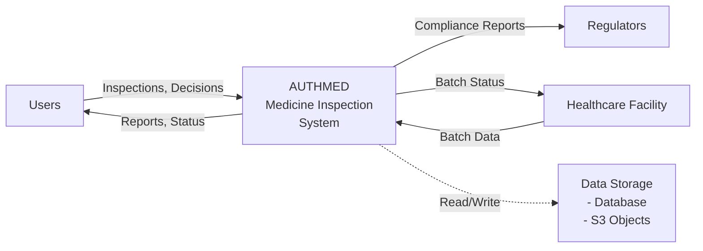
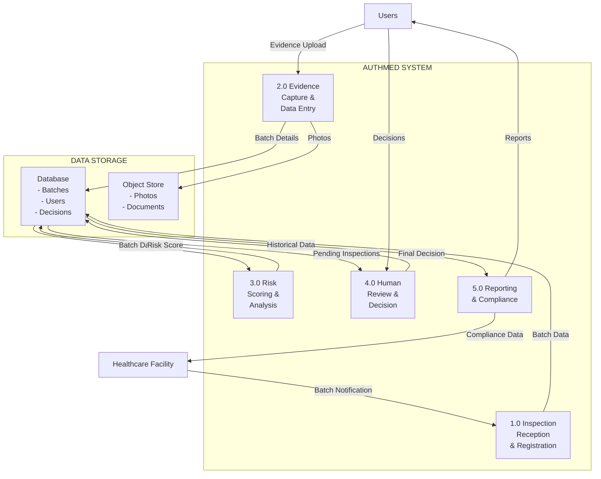
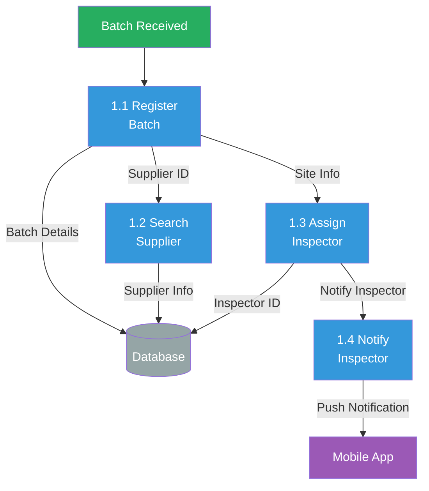
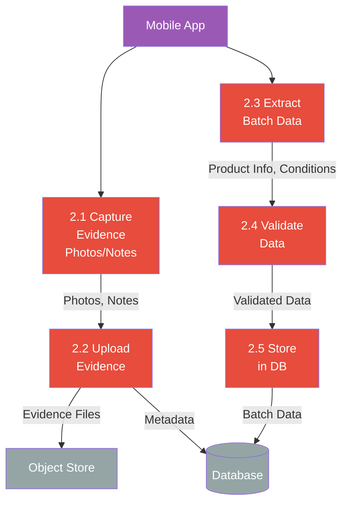
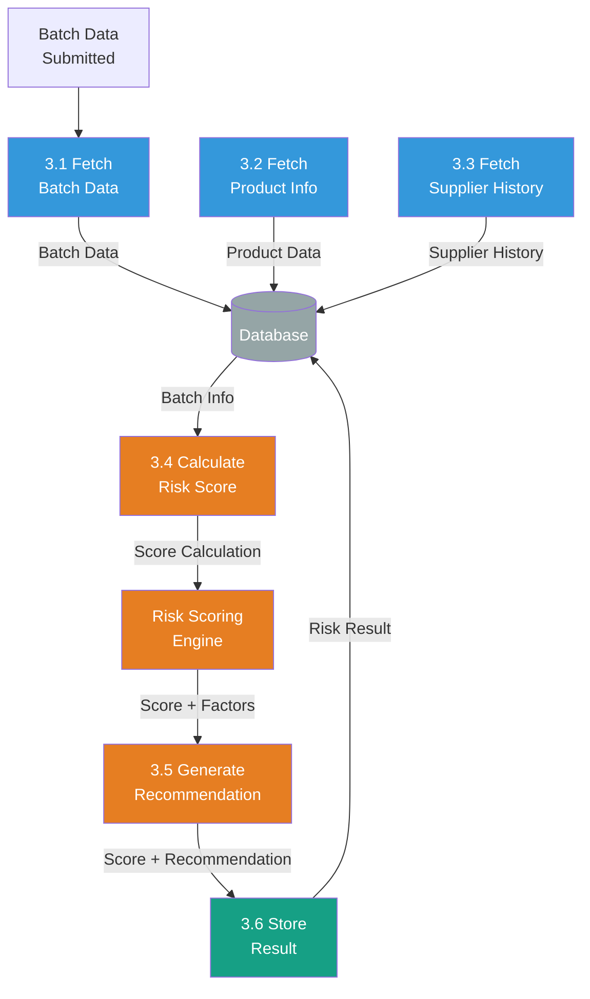
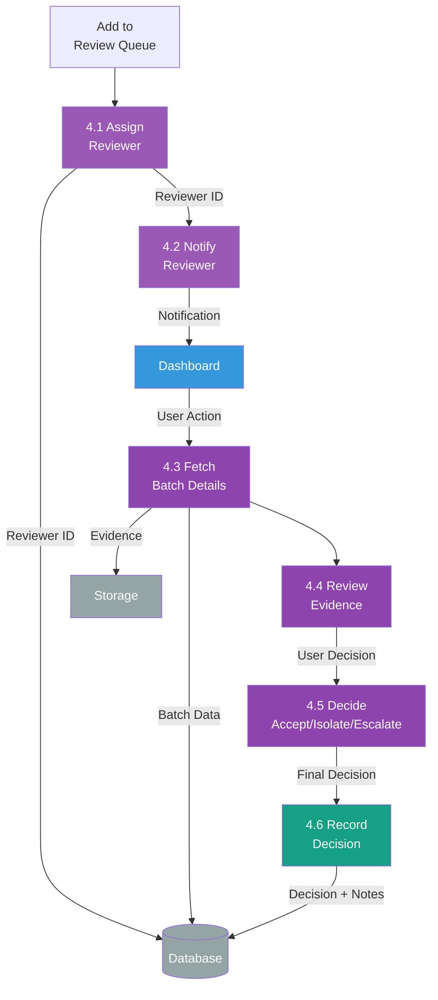
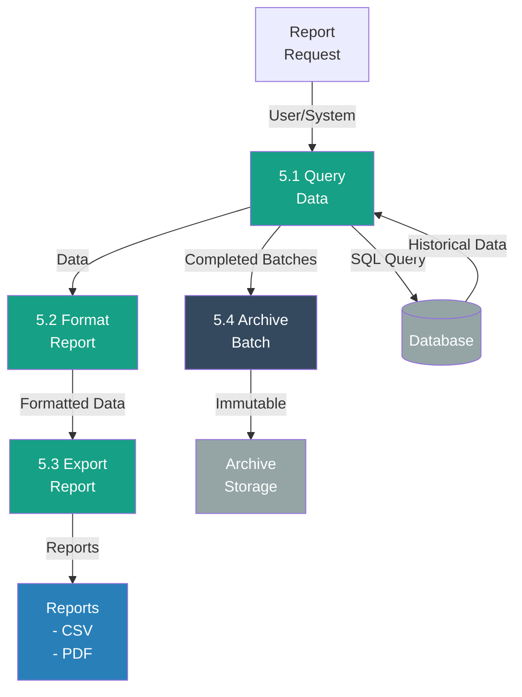

# Data Flow Diagrams (DFD)

## Overview

Data Flow Diagrams (DFD) show how data moves through AuthMed - from users, through processing, into storage, and back out to consumers.

## Level 0: System Context DFD



## Level 1: Major Processes DFD



## Level 2: Detailed Process Flows

### Process 1: Inspection Reception & Registration



### Process 2: Evidence Capture & Data Entry



### Process 3: Risk Scoring & Analysis



### Process 4: Human Review & Decision



### Process 5: Reporting & Compliance



## Complete Data Flow Summary

```
INBOUND DATA:
├── Batch Registration
│   ├── Batch number
│   ├── Supplier ID
│   ├── Product ID
│   ├── Quantity
│   └── Received date/time
│
├── Field Inspection
│   ├── Photos (S3)
│   ├── Inspector notes
│   ├── Conditions observed
│   ├── Anomalies detected
│   └── Timestamps
│
└── Human Decisions
    ├── Reviewer ID
    ├── Decision (Accept/Isolate/Escalate)
    ├── Comments
    └── Override flags

PROCESSING:
├── Risk Scoring
│   ├── Analyze conditions (40%)
│   ├── Detect anomalies (30%)
│   ├── Supplier history (20%)
│   └── Product risk (10%)
│
├── Decision Logic
│   ├── Auto-approve (score < 20)
│   ├── Queue for review (score 20-60)
│   └── Auto-escalate (score > 60)
│
└── Audit Logging
    ├── All user actions
    ├── All system events
    ├── Timestamps
    └── Change history

STORAGE:
├── Database (PostgreSQL)
│   ├── Batch metadata
│   ├── User actions
│   ├── Decisions
│   ├── Risk scores
│   └── Audit logs
│
└── Object Store (S3)
    ├── Evidence photos
    ├── Documents
    └── Export files

OUTBOUND DATA:
├── Real-time Updates
│   ├── Batch status to mobile
│   ├── Queue updates to dashboard
│   └── KPI metrics
│
├── Reports
│   ├── CSV exports
│   ├── PDF compliance reports
│   └── Historical analytics
│
└── Compliance Data
    ├── Audit trails
    ├── Regulatory reports
    └── Traceability records
```

---

## Data Stores

### Primary Database (PostgreSQL)

**Tables:**
- `users` - User accounts and roles
- `organizations` - Multi-org support
- `sites` - Multiple locations per org
- `batch_inspection` - Main batch records
- `evidence` - Photos and documents metadata
- `risk_result` - Calculated risk scores
- `review_decision` - Final decisions
- `audit_log` - Complete activity trail
- `suppliers` - Supplier information
- `products` - Product reference library

### Object Storage (S3)

**Buckets:**
- `authmed-evidence` - Photos and documents
- `authmed-exports` - Report files
- `authmed-archive` - Long-term archive

---

## Data Flows by Use Case

### Use Case 1: Inspect & Score (Minutes 0-7)
```
Batch Registered → Inspector Assigned → Evidence Captured → 
Data Validated → Risk Calculated → Decision Routed
Data Flow: Batch metadata → Photos → Validation → Score
```

### Use Case 2: Review & Approve (Minutes 7-15)
```
Pending Review → Reviewer Opens → Reviews Evidence → 
Makes Decision → Records Audit → Executes Action
Data Flow: Batch details + Evidence → Decision → Action
```

### Use Case 3: Reporting & Audit (On Demand)
```
Query Date Range → Fetch Batches → Fetch Decisions → 
Generate Report → Export to Format
Data Flow: Historical batches → Aggregated metrics → Report
```

---

## Data Security

### At Rest
- Database: Encrypted PostgreSQL (optional)
- S3: Encrypted objects

### In Transit
- HTTPS/TLS for all API calls
- Signed URLs for S3 access
- JWT tokens for authentication

### Access Control
- Role-based permission filtering
- User can only see own org data
- Admin access limited to authorized users
- Audit log immutable

---

## Next Steps

See:
1. [API Interactions](api-interactions.md) - How components exchange data via APIs
2. [API Endpoints](api-endpoints.md) - Detailed endpoint specifications
3. [Database Schema](../data-model/database-schema.md) - Table structures

---

**Key Insight:** Data flows through AuthMed in a structured pipeline from batch intake through inspection, analysis, decision, execution, and permanent archive - with every step logged and auditable.
