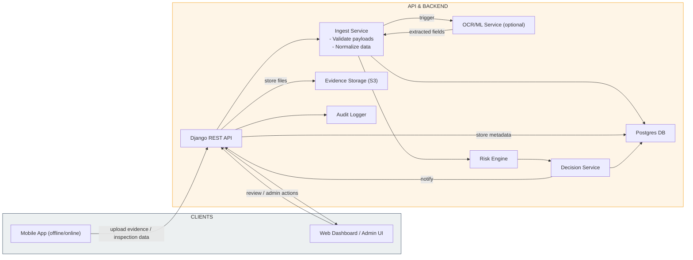

# Data Flow Diagram

**Short explanation**
Data flows from mobile capture through scoring and decision-making, with persistence and audit logging.

```mermaid
flowchart LR
    subgraph CLIENTS["CLIENTS"]
        Mobile["Mobile App (offline/online)"]
        Web["Web Dashboard / Admin UI"]
    end
    
    subgraph API_BACKEND["API & BACKEND"]
        API["Django REST API"]
        Ingest["Ingest Service<br/>- Validate payloads<br/>- Normalize data"]
        Storage["Evidence Storage (S3)"]
        DB["Postgres DB"]
        OCR["OCR/ML Service (optional)"]
        Risk["Risk Engine"]
        Decision["Decision Service"]
        Audit["Audit Logger"]
    end
    
    Mobile -->|upload evidence / inspection data| API
    Web -->|review / admin actions| API
    API --> Ingest --> DB
    API -->|store files| Storage
    API -->|store metadata| DB
    Ingest -->|trigger| OCR
    OCR -->|extracted fields| Ingest
    Ingest --> Risk
    Risk --> Decision
    Decision --> DB
    API --> Audit
    Decision -->|notify| API
    API --> Web
    
    style CLIENTS fill:#ecf0f1,stroke:#34495e
    style API_BACKEND fill:#fef5e7,stroke:#f39c12
```
