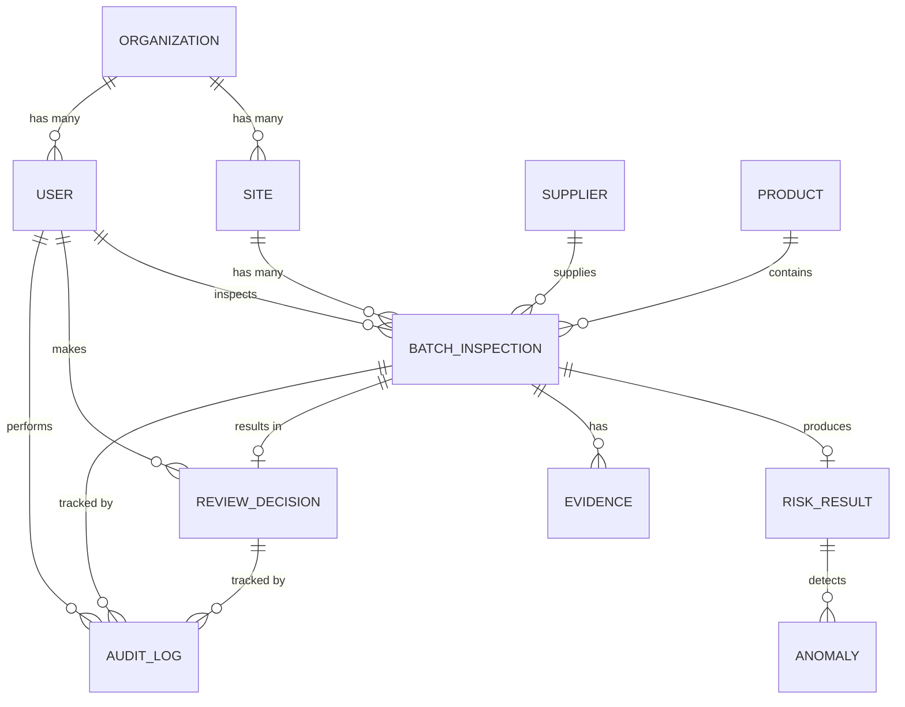

# Domain Model Diagram

## Overview

This diagram shows the core domain entities and their relationships in AuthMed.

## Domain Model



## Core Entities

### Organization
Represents a healthcare organization (hospital, pharmacy chain, distributor)

**Attributes:**
- id (UUID, primary key)
- name (string, 100 chars)
- registration_number (string, unique)
- country (string, ISO 3166-1)
- active (boolean, default true)
- created_at (timestamp)
- updated_at (timestamp)

**Relationships:**
- Has many Sites
- Has many Users
- Has many BatchInspections

---

### Site
Represents a physical location within an organization

**Attributes:**
- id (UUID, primary key)
- organization_id (FK)
- name (string, 100 chars)
- address (string, 500 chars)
- city (string, 50 chars)
- country (string, ISO 3166)
- phone (string, 20 chars)
- manager_id (FK, User)
- active (boolean, default true)
- created_at (timestamp)
- updated_at (timestamp)

**Relationships:**
- Belongs to Organization
- Has many Users (assigned to site)
- Has many BatchInspections

---

### User
Represents a system user (inspector, reviewer, manager, admin, qa)

**Attributes:**
- id (UUID, primary key)
- organization_id (FK)
- site_id (FK, nullable - null = multi-site access for admins/qa)
- username (string, unique, 50 chars)
- email (string, unique, encrypted)
- password_hash (string, bcrypt)
- first_name (string, 50 chars)
- last_name (string, 50 chars)
- role (enum: inspector, reviewer, manager, qa_officer, admin)
- phone (string, 20 chars, encrypted)
- is_active (boolean, default true)
- last_login (timestamp, nullable)
- password_expires_at (timestamp)
- mfa_enabled (boolean, default false)
- created_at (timestamp)
- updated_at (timestamp)

**Relationships:**
- Belongs to Organization
- Belongs to Site (if site-scoped)
- Inspects BatchInspections
- Makes ReviewDecisions
- Performs AuditLogs

---

### Supplier
Represents a pharmaceutical supplier

**Attributes:**
- id (UUID, primary key)
- name (string, 100 chars)
- registration_number (string, 50 chars)
- country (string, ISO 3166)
- contact_person (string, 100 chars, encrypted)
- phone (string, 20 chars, encrypted)
- email (string, encrypted)
- quality_score (float, 0.0-1.0, calculated)
- batches_supplied (integer, calculated)
- batches_rejected (integer, calculated)
- created_at (timestamp)
- updated_at (timestamp)

**Relationships:**
- Supplies many BatchInspections

**Calculated Fields:**
- reliability_score = (batches_supplied - batches_rejected) / batches_supplied
- rejection_rate_percent = (batches_rejected / batches_supplied) * 100

---

### Product
Represents a pharmaceutical product (medicine, vaccine, etc.)

**Attributes:**
- id (UUID, primary key)
- sku (string, unique, 50 chars)
- name (string, 200 chars)
- description (string, 1000 chars)
- manufacturer (string, 100 chars)
- risk_category (enum: low, medium, high)
- requires_refrigeration (boolean)
- storage_temp_min (float, celsius)
- storage_temp_max (float, celsius)
- shelf_life_days (integer)
- created_at (timestamp)
- updated_at (timestamp)

**Relationships:**
- Contained in many BatchInspections

---

### BatchInspection
Main entity representing a pharmaceutical batch inspection

**Attributes:**
- id (UUID, primary key)
- organization_id (FK)
- site_id (FK)
- lot_number (string, 50 chars)
- supplier_id (FK)
- product_id (FK)
- quantity_received (integer)
- received_date (datetime)
- received_by_id (FK, User - who received it)
- inspector_id (FK, User)
- status (enum: draft, pending_inspection, under_inspection, evidence_captured, pending_scoring, scored, pending_review, review_in_progress, accepted, isolated, escalated, execution_pending, archived)
- created_at (timestamp)
- updated_at (timestamp)

**Relationships:**
- Belongs to Organization
- Belongs to Site
- Supplied by Supplier
- Contains Product
- Received by User
- Inspected by User
- Has many Evidence records
- Has one RiskResult
- Has one ReviewDecision
- Has many AuditLog entries

---

### Evidence
Represents evidence captured during inspection (photos, documents, notes)

**Attributes:**
- id (UUID, primary key)
- batch_inspection_id (FK)
- type (enum: photo, document, note, video)
- description (string, 500 chars)
- file_url (string, S3 URL, nullable)
- file_size_bytes (integer)
- mime_type (string, 50 chars)
- uploaded_by_id (FK, User - inspector)
- uploaded_at (timestamp)
- thumbnail_url (string, S3 URL, nullable - for photos)
- created_at (timestamp)

**Relationships:**
- Belongs to BatchInspection
- Uploaded by User

---

### RiskResult
Represents the calculated risk score for a batch

**Attributes:**
- id (UUID, primary key)
- batch_inspection_id (FK, unique)
- risk_score (float, 0.0-100.0)
- recommendation (enum: accept, isolate, escalate)
- condition_score (float, 0-100)
- condition_weight (float, typically 0.4)
- anomaly_score (float, 0-100)
- anomaly_weight (float, typically 0.3)
- supplier_score (float, 0-100)
- supplier_weight (float, typically 0.2)
- product_score (float, 0-100)
- product_weight (float, typically 0.1)
- confidence_percent (float, 0-100, how confident the score is)
- calculated_at (timestamp)
- calculated_by (string, "system")

**Relationships:**
- Belongs to BatchInspection
- Has many Anomalies detected

---

### Anomaly
Detected anomalies during risk scoring

**Attributes:**
- id (UUID, primary key)
- risk_result_id (FK)
- anomaly_type (enum: seal_damage, packaging_damage, contamination, discoloration, temperature_exposure, humidity_exposure, leakage, other)
- description (string, 500 chars)
- severity (enum: low, medium, high)
- evidence_link_ids (array of Evidence IDs, JSON)
- detected_at (timestamp)

**Relationships:**
- Belongs to RiskResult
- Links to Evidence records

---

### ReviewDecision
Final decision on a batch inspection by a reviewer

**Attributes:**
- id (UUID, primary key)
- batch_inspection_id (FK, unique)
- risk_result_id (FK, nullable)
- reviewer_id (FK, User)
- decision (enum: accepted, isolated, escalated)
- override_risk_recommendation (boolean, true if decision differs from risk score)
- notes (string, 2000 chars)
- evidence_reviewed (array of Evidence IDs, JSON)
- created_at (timestamp)
- updated_at (timestamp)

**Relationships:**
- Belongs to BatchInspection
- References RiskResult (if available)
- Made by User (reviewer)

---

### AuditLog
Immutable record of all system actions (for compliance)

**Attributes:**
- id (UUID, primary key)
- organization_id (FK)
- actor_id (FK, User, nullable - nullable for system actions)
- action (enum: created, updated, deleted, viewed, decision_made, evidence_uploaded, risk_calculated, etc.)
- resource_type (enum: batch_inspection, evidence, decision, user, supplier, product)
- resource_id (string, ID of affected resource)
- changes (JSON, what changed: {field: [old_value, new_value]})
- reason (string, why it happened, 500 chars)
- ip_address (string, 45 chars, nullable)
- user_agent (string, 500 chars, nullable)
- created_at (timestamp, immutable)

**Relationships:**
- Belongs to Organization
- Performed by User (nullable for system actions)

**Immutability:** AuditLog entries cannot be modified or deleted after creation (except by direct database admin action)

---

## Aggregate Root

**BatchInspection is the aggregate root** - it's the central entity that coordinates:
- Who inspected it (User/Inspector)
- What evidence was captured (Evidence)
- What risk was calculated (RiskResult)
- What decision was made (ReviewDecision)
- What happened (AuditLog)

All operations flow through BatchInspection status transitions:
```
Draft → Pending → Under Inspection → Evidence Captured → 
Pending Scoring → Scored → [Review or Auto-Decide] → 
Accepted/Isolated/Escalated → Archived
```

---

## Database Normalization

All entities follow 3rd Normal Form (3NF):
- No partial dependencies
- No transitive dependencies
- All non-key attributes dependent on entire primary key

---

## Constraints

### Primary Key Constraints
- All IDs are UUIDs (not auto-increment)
- Unique constraint on lot_number + supplier_id + received_date (prevents duplicates)

### Foreign Key Constraints
- Cascade delete not used (preserve audit trail)
- Soft deletes: is_active flag instead of hard delete

### Data Integrity
- NOT NULL constraints on required fields
- CHECK constraints on enums
- Unique constraints on email, username
- Index on status for query performance

---

## Next Steps

See:
1. [Database Schema](database-schema.md) - Full schema with indexes
2. [Batch Inspection Entity](batch-inspection-entity.md) - Detailed entity spec
3. [API Interactions](../architecture/api-interactions.md) - How entities are used

---

**Key Insight:** Domain model shows how BatchInspection is the central aggregate, coordinating evidence capture, risk scoring, human review, and permanent audit trails.
