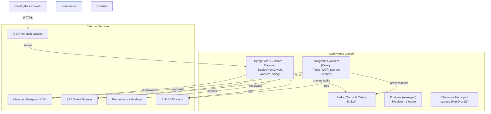

# Deployment Diagram

**Explication courte**
Diagramme de déploiement cible : composants sur Kubernetes, stockage, CDN, services managés et points de monitoring.

```mermaid
flowchart TB
    subgraph "Kubernetes Cluster"
        APIServer["Django API (Gunicorn + Daphne)\n- Deployments: web, workers, celery"]
        Workers["Background workers (Celery)\n- Tasks: OCR, scoring, exports"]
        Redis["Redis (Cache & Celery broker)"]
        Postgres["Postgres (managed)\n- Persistent storage"]
        Minio["S3-compatible object storage (MinIO or S3)"]
    end
    
    subgraph "External Services"
        CDN["CDN (for static assets)"]
        DBManaged["Managed Postgres (RDS)"]
        ObjectStore["S3 / Object Storage"]
        Monitoring["Prometheus + Grafana"]
        Logging["ELK / EFK stack"]
    end
    
    User["Client (Mobile / Web)"]
    User -->|HTTPS| CDN
    CDN -->|serves| APIServer
    APIServer -->|reads/writes| DBManaged
    APIServer -->|stores| ObjectStore
    APIServer -->|queues tasks| Redis
    Workers -->|process tasks| Redis
    Workers -->|read/write| DBManaged
    Workers -->|read/write| ObjectStore
    APIServer -->|metrics| Monitoring
    APIServer -->|logs| Logging
    Workers -->|logs| Logging
    
    style Kubernetes Cluster fill:#f0f9ff,stroke:#0366d6
    style External Services fill:#f9f0ff,stroke:#6f42c1
```
