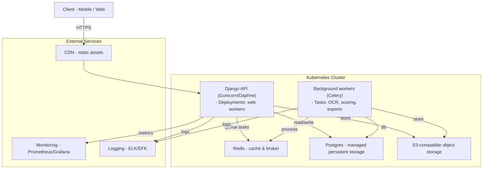

# Deployment Diagram

## Overview

Target deployment architecture showing components in a cluster and connections to managed services.

```mermaid
flowchart TB
    subgraph K8S["Kubernetes Cluster"]
        APIServer["Django API (Gunicorn/Daphne)\n- Deployments: web, workers"]
        Workers["Background workers (Celery)\n- Tasks: OCR, scoring, exports"]
        Redis["Redis - cache & broker"]
        Postgres["Postgres - managed persistent storage"]
        ObjectStore["S3-compatible object storage"]
    end

    subgraph External["External Services"]
        CDN["CDN - static assets"]
        Monitoring["Monitoring - Prometheus/Grafana"]
        Logging["Logging - ELK/EFK"]
    end

    User["Client - Mobile / Web"]
    User -->|HTTPS| CDN
    CDN --> APIServer
    APIServer -->|read/write| Postgres
    APIServer -->|store| ObjectStore
    APIServer -->|queue tasks| Redis
    Workers -->|process| Redis
    Workers -->|db| Postgres
    Workers -->|store| ObjectStore
    APIServer -->|metrics| Monitoring
    APIServer -->|logs| Logging
    Workers -->|logs| Logging

```
