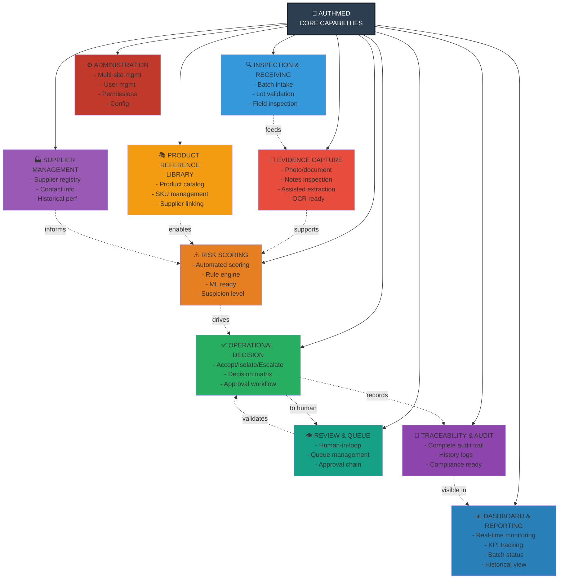

# Business Capability Map

## Overview

This diagram identifies the 10 core capabilities that AuthMed provides to achieve its mission of medicine intake inspection and risk control.

## Capabilities Map



## Capability Descriptions

### 1. Inspection & Receiving
**Purpose:** Manage the intake of medicine batches  
**Features:**
- Register incoming batches with lot number, supplier, product, date
- Assign inspector for field inspection
- Track batch through receiving process
- Support for partial batches or split lots

**Business Value:** Foundation for all inspections; ensures no batch is missed

---

### 2. Evidence Capture
**Purpose:** Document inspection findings with multimedia evidence  
**Features:**
- Mobile app for photo/video capture
- Document upload (test results, certificates, etc.)
- Timestamped notes from inspector
- GPS location tagging (optional)
- OCR-ready for future data extraction

**Business Value:** Irrefutable evidence trail; supports decision-making

---

### 3. Product Reference Library
**Purpose:** Maintain master catalog of known medicines  
**Features:**
- Product CRUD (name, SKU, manufacturer, expected packaging)
- Supplier linkage per product
- Historical rejection rates by product
- Known issues or watch list markers

**Business Value:** Risk rules can reference product characteristics; supplier history informs scoring

---

### 4. Supplier Management
**Purpose:** Track pharmaceutical suppliers and their performance  
**Features:**
- Supplier registry (name, contact, address, license)
- Historical performance metrics (rejection rate, common issues)
- Supplier reliability score
- Contact information for escalations

**Business Value:** Risk scoring can penalize unreliable suppliers; escalation contacts available

---

### 5. Risk Scoring
**Purpose:** Automatically calculate inspection risk  
**Features:**
- Rule-based scoring engine (MVP)
- Multiple scoring factors:
  - Batch conditions (temperature, humidity, packaging)
  - Observable anomalies (damage, contamination signs)
  - Supplier history (past issues)
  - Product risk category
  - Environmental factors
- Produces numeric score (0-100)
- Flags detected anomalies
- Suspicion level (low/medium/high)

**Business Value:** Removes subjectivity; enables consistent decision-making

---

### 6. Operational Decision
**Purpose:** Generate actionable decision from risk score  
**Features:**
- Accept: Risk score < threshold (batch approved for stock)
- Isolate: Risk score in medium range (quarantine, further analysis)
- Escalate: Risk score > threshold (immediate escalation to management)
- Decision matrix based on rules
- Optional: Auto-decision for clear cases, human review for edge cases

**Business Value:** Clear, auditable operational decisions

---

### 7. Review & Queue Management
**Purpose:** Human-in-the-loop workflow for complex decisions  
**Features:**
- Queue of inspections pending review
- Priority sorting (by risk score, by urgency)
- Reviewer assignment
- Evidence display and annotation
- Approve/reject decision interface
- Comments and notes

**Business Value:** Human judgment validates automated decisions; reduces false positives

---

### 8. Traceability & Audit
**Purpose:** Maintain immutable record of all actions  
**Features:**
- Audit log of every action (create, read, update, delete)
- User/actor tracking
- Timestamp on all records
- Change history (what changed, by whom, when, why)
- Compliance-ready export formats

**Business Value:** 100% traceability for regulatory compliance

---

### 9. Dashboard & Reporting
**Purpose:** Provide visibility into inspection metrics and status  
**Features:**
- Real-time KPI dashboard
  - Total batches inspected today/week/month
  - Acceptance rate %
  - Rejection rate %
  - Average risk score
  - Supplier performance trends
- Batch status view (by stage in workflow)
- Historical trend analysis
- CSV/PDF export for reports
- Multi-site roll-up views
- Customizable alerts

**Business Value:** Management visibility; enables process improvement; supports compliance reporting

---

### 10. Administration
**Purpose:** System configuration and user management  
**Features:**
- Organization and site management
- User CRUD and role assignment
- Permission management (role-based access control)
- Configuration (risk thresholds, decision rules, scoring weights)
- System health monitoring
- Audit log viewing

**Business Value:** Enterprise-scale management; delegation of responsibilities

---

## Capability Dependencies

```
Inspection
    ↓
Evidence Capture
    ↓
+ Product Lib + Supplier Mgmt
    ↓
Risk Scoring
    ↓
Operational Decision
    ↓
Review & Queue (if needed)
    ↓
Traceability & Audit
    ↓
Dashboard & Reporting
    ↑
Administration (supports all)
```

---

## Phase Roadmap by Capability

### MVP (Foundation)
- ✅ Inspection & Receiving
- ✅ Evidence Capture (basic)
- ✅ Product Reference Library (basic)
- ✅ Supplier Management (basic)
- ✅ Risk Scoring (basic rules)
- ✅ Operational Decision (simple logic)
- ✅ Traceability & Audit
- ⚠️ Review & Queue (manual, no UI yet)
- ⚠️ Dashboard (API only, no UI)
- ✅ Administration

### Phase 1
- ✅ Review & Queue Management (full feature)
- ✅ Dashboard (web UI)
- ⚠️ Reporting (basic export)
- ⚠️ Notifications (email alerts)

### Phase 2
- ✅ Evidence Capture (OCR-ready, enhanced)
- ✅ Risk Scoring (advanced rules)
- ✅ Reporting (PDF generation)
- ✅ Mobile Optimization
- ✅ Performance Tuning

### Future
- 🚀 ML-based Risk Scoring
- 🚀 OCR/Assisted Data Extraction
- 🚀 Supplier Scoring (ML predictions)
- 🚀 IoT Integration
- 🚀 Advanced Compliance Reporting

---

## Next Steps

See:
1. [Use Cases](../workflows/use-cases.md) - How users interact with each capability
2. [Business Workflow](../workflows/business-workflow.md) - How capabilities work together
3. [MVP Phase Mapping](mvp-phase-mapping.md) - Implementation timeline

---

**Key Insight:** AuthMed's 10 capabilities work together to create a complete inspection-to-audit workflow that transforms manual processes into auditable, data-driven operations.
