# End-to-End Product Flow Summary

## Overview

This diagram summarizes the complete journey of a medicine batch through AuthMed - from physical arrival at a healthcare facility through digital inspection, risk assessment, decision-making, execution, and permanent audit archival.

## End-to-End Flow

```mermaid
flowchart TD
    Start["🚀 RÉCEPTION LOT<br/>Médicament arrive<br/>à la pharmacie/hôpital"]
    
    subgraph "PHASE_1_CAPTURE"
        C1["📋 ENREGISTREMENT<br/>- Identification lot<br/>- Supplier, product<br/>- Reçu par qui"]
        C2["🔍 INSPECTION TERRAIN<br/>- Inspector assigné<br/>- Vérification physique<br/>- Prélèvement conditions"]
        C3["📸 CAPTURE PREUVES<br/>- Photos conditions<br/>- Notes anomalies<br/>- Métadonnées"]
    end
    
    subgraph "PHASE_2_ANALYSIS"
        A1["🖊️ EXTRACTION INFO<br/>- Données batch<br/>- Conditions stockage<br/>- Observations terrain"]
        A2["⚠️ SCORING RISQUE<br/>- Analyse automatique<br/>- Règles métier<br/>- Calcul score"]
        A3["✅ DÉCISION AUTO<br/>- Accepté (score < X)<br/>- Isolé (score Y-Z)<br/>- Escaladé (score > Z)"]
    end
    
    subgraph "PHASE_3_REVIEW"
        R1["👁️ REVUE HUMAINE<br/>- Reviewer lit preuves<br/>- Valide score<br/>- Approuve/rejette"]
        R2["✔️ DÉCISION FINALE<br/>- Accept → Stockage<br/>- Isolate → Quarantine<br/>- Escalate → Direction"]
    end
    
    subgraph "PHASE_4_EXECUTION"
        E1["⚙️ EXÉCUTION<br/>- Mise à jour statut<br/>- Notification stakeholders<br/>- Action opérationnelle"]
        E2["📊 DASHBOARD UPDATE<br/>- Statut visible<br/>- Métrique mise à jour<br/>- KPI recalculé"]
    end
    
    subgraph "PHASE_5_TRACE"
        T1["🔗 AUDIT TRAIL<br/>- Historique complet<br/>- Timestamps<br/>- Tous acteurs"]
        T2["📄 RAPPORTS<br/>- Export CSV/PDF<br/>- Conformité<br/>- Compliance ready"]
    end
    
    Start --> C1
    C1 --> C2
    C2 --> C3
    
    C3 --> A1
    A1 --> A2
    A2 --> A3
    
    A3 -->|Si complexe| R1
    A3 -->|Si clair| R2
    R1 --> R2
    
    R2 --> E1
    E1 --> E2
    
    E2 --> T1
    T1 --> T2
    
    T2 --> End["✅ INSPECTION COMPLÈTE<br/>Lot tracé définitivement<br/>Historique permanent"]
    
    style Start fill:#27ae60,color:#fff,stroke-width:3px
    style PHASE_1_CAPTURE fill:#3498db,color:#fff
    style PHASE_2_ANALYSIS fill:#e67e22,color:#fff
    style PHASE_3_REVIEW fill:#9b59b6,color:#fff
    style PHASE_4_EXECUTION fill:#27ae60,color:#fff
    style PHASE_5_TRACE fill:#16a085,color:#fff
    style End fill:#c0392b,color:#fff,stroke-width:3px
```

## Phase-by-Phase Breakdown

### Phase 1: CAPTURE (Minutes 0-2)
**Actors:** Receiving staff, Inspector  
**Location:** Physical warehouse/pharmacy  

**Activity:**
1. Medicine batch arrives
2. Lot is registered in AuthMed (batch number, supplier, product, quantity, date)
3. Inspector is assigned notification (push to mobile)
4. Inspector locates and verifies batch identity
5. Physical inspection occurs (check packaging, seals, conditions)

**Output:** Batch registered in system, status = "Under Inspection"

---

### Phase 2: ANALYSIS (Minutes 2-4)
**Actors:** Inspector (field), Risk Engine (automated)  
**Location:** Field + Backend  

**Activity:**
1. Inspector captures photos of batch (packaging, seals, damage, conditions)
2. Inspector records notes (observations, anomalies, temperature, humidity)
3. Data is uploaded to AuthMed
4. Risk Engine analyzes:
   - Batch condition factors (damage, seal integrity, temperature exposure)
   - Observable anomalies (contamination signs, discoloration, leakage)
   - Supplier historical reliability
   - Product risk category (from product library)
   - Combined scoring formula
5. Risk score calculated (0-100)
6. System automatically proposes decision:
   - Score < 20: ACCEPT (green)
   - Score 20-60: ISOLATE (yellow)
   - Score > 60: ESCALATE (red)

**Output:** RiskResult generated, decision proposed, status = "Pending Review"

---

### Phase 3: REVIEW (Minutes 4-5, or later if needed)
**Actors:** Reviewer (Pharmacist/Quality Officer)  
**Location:** Office/Dashboard  

**Activity:**
1. Batch appears in reviewer's decision queue
2. Reviewer accesses batch details on dashboard:
   - Photos of batch
   - Inspector notes
   - Risk score and reasoning
   - Supplier history
   - Product information
3. Reviewer examines evidence
4. Reviewer validates (or overrides) the automated decision
5. Reviewer provides additional notes if needed
6. Reviewer submits final decision (Accept/Isolate/Escalate)

**Output:** ReviewDecision recorded, final decision stored, status = "Review Complete"

**Note:** If automated decision was clear (low or high risk), review may be expedited. If borderline, reviewer may request additional inspection.

---

### Phase 4: EXECUTION (Minutes 5-10)
**Actors:** Logistics/Warehouse staff  
**Location:** Physical warehouse  

**Activity:**

**If ACCEPTED:**
- Batch released to stock
- Moved to shelves
- Available for dispensing
- Status updated to "Accepted"

**If ISOLATED:**
- Batch moved to quarantine area
- Flagged for further analysis or observation
- May require additional testing
- Status updated to "Isolated"

**If ESCALATED:**
- Batch held immediately
- Director/Quality Officer notified
- Investigation initiated
- Potential rejection, supplier contact, regulatory reporting
- Status updated to "Escalated"

**Additional Actions:**
- Dashboard updated with new status
- Manager receives notification
- All stakeholders can see outcome

**Output:** Decision executed, batch in final state

---

### Phase 5: TRACE & REPORTING (Ongoing)
**Actors:** Audit, Compliance, Management  
**Location:** System  

**Activity:**
1. Complete audit trail permanently stored:
   - Who registered the batch
   - When inspection occurred
   - What evidence was captured
   - How risk was calculated
   - Who reviewed it
   - What decision was made
   - When it was executed
   - Any changes or amendments

2. Dashboards and reports available anytime:
   - Batch history searchable by lot number, supplier, product, date
   - Trend analysis (acceptance rates, rejection reasons, suppliers to watch)
   - Regulatory compliance reports (exportable)
   - KPI tracking

3. Evidence archived permanently:
   - Photos remain accessible
   - Notes remain accessible
   - Can generate compliance certificates

**Output:** Batch fully traceable, compliance-ready, historical

---

## Total Process Timeline

| Phase | Duration | Status |
|-------|----------|--------|
| Reception → Registration | 1 min | Batch In System |
| Field Inspection | 1-2 min | Inspector Working |
| Analysis + Scoring | 1-2 min | System Processing |
| Review (if needed) | 0-5 min | Reviewer Working |
| Execution | 5-10 min | Batch Released/Quarantined |
| **Total** | **~5-15 min** | **Complete** |

**Old Process (Manual):** 30-60 minutes, often incomplete documentation  
**AuthMed Process:** 5-15 minutes, complete digital documentation  
**Improvement:** 4-6x faster, 100% traceable

---

## Data Created Throughout Journey

**By the end, AuthMed stores:**

1. **BatchInspection** record with:
   - Batch number, supplier, product
   - Inspector who conducted inspection
   - Status progression
   - Final outcome (accept/isolate/escalate)
   - Timestamps for each status change

2. **Evidence** records:
   - Photos (20-50 files typically)
   - Notes/observations from inspector
   - Each timestamped and attributed to inspector

3. **RiskResult** record:
   - Calculated risk score (0-100)
   - Scoring factors and reasoning
   - Anomalies detected
   - Confidence level

4. **ReviewDecision** record:
   - Final decision by reviewer
   - Reviewer comments
   - Timestamp of review
   - Whether decision was automated or human-overridden

5. **AuditLog** entries (10+ records):
   - Batch created by user X at time Y
   - Status changed from A to B by user X
   - Evidence added by user X
   - Risk calculated automatically
   - Decision made by user X
   - Batch released to stock by user X
   - Each with full timestamp and context

**Result:** Complete, auditable, 7-year compliance-ready digital record

---

## Exception Handling

### What if inspector has questions?
- Inspector can add notes during inspection
- Can upload additional photos
- Can request preliminary feedback
- Doesn't hold up the workflow

### What if risk score seems wrong?
- Reviewer can override decision
- Can add notes explaining override
- Override is audited
- System learns from feedback (future ML)

### What if batch needs additional testing?
- Can be isolated pending lab results
- Status remains "Isolated" until resolved
- Can re-inspect batch with new evidence
- New decision made when ready

### What if there's a recall later?
- Can search by batch number, supplier, product
- Can find all affected batches instantly
- Can see which have been released to stock
- Can track which patient/pharmacy received it (future integration)

---

## Stakeholders & Their View

| Role | Sees | When | Frequency |
|------|------|------|-----------|
| **Inspector** | Assigned inspections | Mobile app push | Daily |
| **Reviewer** | Decision queue | Dashboard | Daily |
| **Manager** | KPI dashboard | Dashboard | Daily/Weekly |
| **Quality Officer** | Audit trails | Dashboard/reports | Daily/Monthly |
| **Compliance/Legal** | Compliance reports | Portal/export | On demand |
| **Supplier** | (Optional) Rejection feedback | Email | Upon escalation |

---

## Key Metrics Tracked

By batch end-to-end:
- Time from reception to decision
- Acceptance rate (%)
- Rejection rate (%)
- Escalation rate (%)
- Average risk score
- Inspector performance
- Reviewer consistency
- Supplier reliability score
- Product risk categories

---

## Compliance & Regulatory

At any time, AuthMed can produce:
- Batch inspection report (PDF)
- Audit trail export (CSV)
- Regulatory compliance certificate
- Supplier performance summary
- Risk distribution analysis
- Decision audit (showing all changes and overrides)

All formats exportable for:
- Internal audit
- External regulator inspection
- Accreditation bodies
- Legal proceedings

---

## Next Steps for Learning

1. **Detailed Workflow:** See [Business Workflow](../workflows/business-workflow.md)
2. **Data Model:** See [Domain Model](../data-model/domain-model.md)
3. **Sequence Details:** See [Sequence Diagrams](../sequences/)
4. **Technical Stack:** See [Architecture Overview](../authmed-architecture-overview.md)

---

**Key Insight:** AuthMed transforms a chaotic, untraced manual process into a clean, data-driven, fully traceable workflow that takes 5-15 minutes and produces compliance-ready digital records.

**Business Impact:** Better decisions + Faster operations + Complete compliance = Competitive advantage
