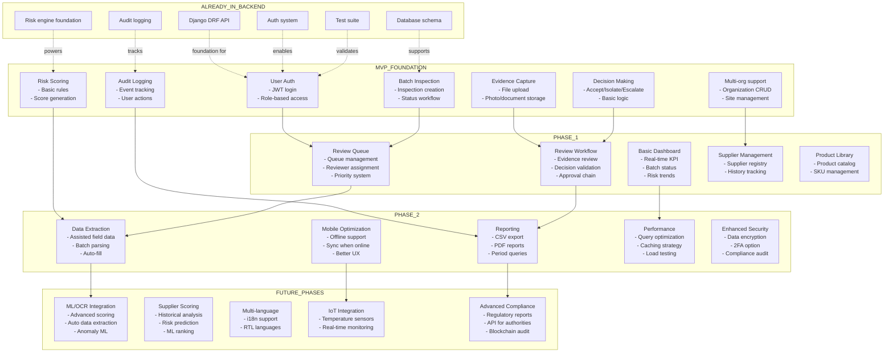

# MVP / Phase Mapping Diagram

## Overview

This diagram shows the distribution of features and capabilities across MVP, Phase 1, Phase 2, and Future phases, along with what is already implemented in the current backend foundation.

## Deliverable Mapping



## Phase Breakdown

### MVP (Minimum Viable Product) - Foundation (Completed)
**Timeline:** Already implemented  
**Target:** Internal testing, proof of concept

**Features:**
1. **User Authentication** - JWT-based login with role assignment
2. **Multi-Organization Support** - Multiple orgs, multiple sites per org
3. **Batch Inspection Management** - CRUD for inspections, status workflow
4. **Evidence Capture** - File upload and storage (photos, documents)
5. **Basic Risk Scoring** - Simple rule-based scoring
6. **Decision Making** - Accept/Isolate/Escalate outcomes
7. **Audit Logging** - Complete activity trail

**Backend Deliverables:**
- Django REST Framework API
- PostgreSQL database schema
- Authentication system (JWT + refresh tokens)
- Risk scoring engine (basic rules)
- Audit logging system
- Test suite (14/14 passing)
- Seed data command

**Status:** Ready for Phase 1

---

### Phase 1 (Review & Monitoring) - Enablement
**Timeline:** 6-8 weeks  
**Target:** Production pilot with limited users

**Features:**
1. **Review Queue** - Inspections queued for human review
2. **Review Workflow** - Reviewer dashboard with evidence view
3. **Basic Dashboard** - Real-time KPI and batch status monitoring
4. **Supplier Management** - Full supplier registry and history
5. **Product Library** - Complete product catalog

**Frontend Deliverables:**
- Web dashboard (React/Vue)
- Review queue interface
- Mobile notifications
- KPI dashboard

**Backend Enhancements:**
- Dashboard API endpoints
- Review queue logic
- Email notifications
- Decision approval workflow

**Success Criteria:**
- 100% of batches reviewed within 24 hours
**Batch Inspection Management** (Completed)
- 90% feature completion

---

**Evidence Capture** (Completed)
**Timeline:** 8-10 weeks  
**Target:** Full production deployment

**Features:**
**Risk Scoring Foundation** (Completed)
2. **Advanced Reporting** - CSV, PDF exports with custom queries
3. **Mobile Optimization** - Offline support, sync, improved UX
4. **Performance** - Query optimization, caching, load testing
5. **Enhanced Security** - Encryption, 2FA, compliance audit
**Decision Making** (Completed)
**Frontend Deliverables:**
- Mobile app improvements (React Native)
- Advanced dashboard features
- Export/report generation UI
**Audit Logging** (Completed)

**Backend Enhancements:**
- Redis caching layer
- Report generation service
**API Foundation** (Completed)
- Performance profiling and tuning
- Security hardening

**Success Criteria:**
- System supports 100+ concurrent users
**Database** (Completed)
- Inspection time < 5 minutes avg
- All features tested and stable

---
**Testing** (Completed)
### Future Phases (Intelligence & Integration) - Next Horizon
**Timeline:** TBD  
**Target:** Advanced capabilities and ecosystem integration

1. **ML/OCR Integration** - AI-based risk scoring and auto data extraction
2. **Supplier Scoring** - ML predictions of supplier reliability
3. **Multi-Language** - i18n support, RTL language support
4. **IoT Integration** - Real-time temperature/humidity monitoring
5. **Advanced Compliance** - Regulatory body APIs, blockchain audit trail

**Strategic Value:**
- Further reduction in manual effort
- Predictive quality control
- Global expansion support
- Real-time condition monitoring
- Regulatory automation

---

- ## What's Already in the Backend (MVP Complete)

- **User Management** (Completed)
- JWT authentication with refresh tokens
- Role-based access control (RBAC)
- Multi-org/site support
- User model with roles (Admin, Inspector, Reviewer, etc.)

**Batch Inspection Management** (Completed)
- BatchInspection model with full status workflow
- Status transitions (Draft → Pending → UnderInspection → PendingReview → Review → Accepted/Isolated/Escalated → Archived)
- Batch number, supplier, product, inspector assignment

**Evidence Capture** (Completed)
- Evidence model for storing file metadata
- File upload endpoints
- Timestamped, user-attributed evidence

**Risk Scoring Foundation** (Completed)
- RiskResult model
- Basic scoring logic
- Risk score storage and retrieval

**Decision Making** (Completed)
- ReviewDecision model
- Three outcomes: accepted, isolated, escalated
- Reviewer assignment

**Audit Logging** (Completed)
- AuditLog model
- Automatic logging of all model changes
- Complete activity trail with timestamps

**API Foundation** (Completed)
- Django REST Framework with proper serialization
- Authentication on all endpoints
- Pagination and filtering
- Error handling

**Database** (Completed)
- PostgreSQL schema fully designed
- All relationships defined
- Migrations in place

**Testing** (Completed)
- 14/14 workflow tests passing
- Test coverage for core features
- Seed data for demo

---

## Dependency Chain

```
MVP Features
    ↓ (foundation)
Phase 1 Features
    ↓ (enablement)
Phase 2 Features
    ↓ (optimization)
Future Features
    (innovation)
```

Each phase builds on the previous, with no features going backward.

---

## Resource Allocation

### MVP (Week 1-2) - 40 hours
- Already complete
- Deploy to development
- Train team on code

### Phase 1 (Week 3-10) - 120 hours
- Frontend developer: Web dashboard, review UI
- Backend developer: Queue logic, APIs
- QA: Testing, bug fixes

### Phase 2 (Week 11-20) - 140 hours
- Full-stack team: Performance + mobile
- DevOps: Caching, load balancing
- QA: Load testing, security

### Future - TBD
- Dedicated ML/AI team
- IoT integration team
- International expansion team

---

## Success Metrics by Phase

### MVP
- 14/14 tests passing
- Demo data works
- JWT login functional
- Batch inspection workflow complete

### Phase 1
- Dashboard displays real data
- Review queue manages 50+ batches
- KPI accuracy > 99%
- User adoption > 80%

### Phase 2
- System uptime 99.5%
- Inspection time avg 5 min
- 100+ concurrent users
- All features production-ready

### Future
- Risk prediction accuracy > 95%
- Auto-extraction success rate > 90%
- ML model ROI positive
- Multi-language support working

---

## Next Steps

1. **Complete MVP Testing** - Run through all workflows
2. **Plan Phase 1** - Specify dashboard UI mockups
3. **Recruit Team** - Frontend developer for Phase 1
4. **Deploy Dev Environment** - Staging server for team testing
5. **Begin Phase 1 Work** - Week 3+

See also:
- [Architecture Overview](../authmed-architecture-overview.md)
- [End-to-End Flow](end-to-end-product-flow.md)
- [Business Workflow](../workflows/business-workflow.md)

---

**Status:** MVP Complete | Phase 1 In Planning | Phase 2 Future | Beyond Innovation

**Last Updated:** May 19, 2026
