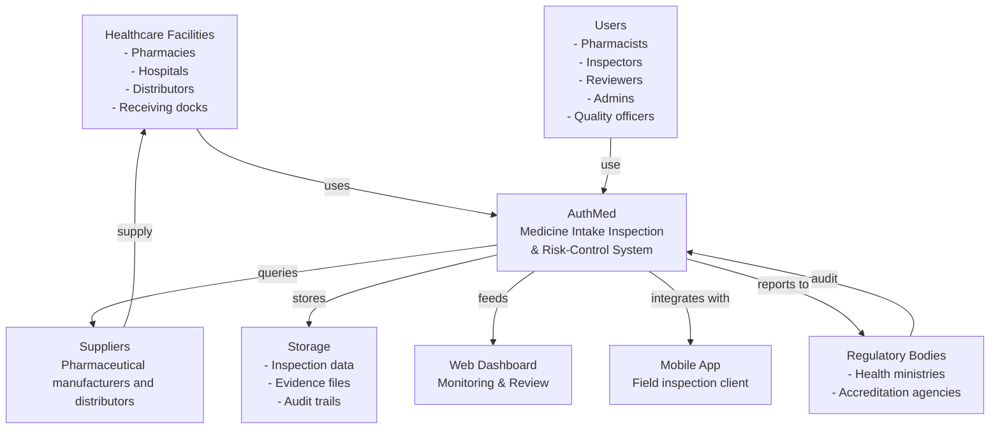

# Product Context Diagram

## Overview

This diagram shows AuthMed positioned within its operating environment - the ecosystem of healthcare facilities, suppliers, users, regulators, and data flows.

## Context Diagram

## Ecosystem Components

### Healthcare Facilities
**Who:** Hospitals, pharmacies, distributors, pharmaceutical receiving centers  
**What they do:** Receive medicine batches, use AuthMed to inspect them, make accept/isolate/escalate decisions  
**What they need:** Quick, reliable inspections with full traceability

### Suppliers
**Who:** Pharmaceutical manufacturers and distributors  
**What they do:** Supply batches; provide product info; historical performance data  
**What they need:** Visibility into rejection reasons for quality improvement

### Users
**Who:** 
- Pharmacists (field inspectors)
- Inspectors (dedicated inspection staff)
- Reviewers (quality officers, pharmacists approving decisions)
- Admins (system management)
- Organization managers (oversight)

**What they do:** Conduct inspections, capture evidence, make decisions, review audits  
**What they need:** Simple, mobile-first interface; quick feedback; authority to make decisions

### Regulatory Bodies
**Who:** Health ministries, pharmacy boards, accreditation agencies  
**What they do:** Audit compliance, certify facilities  
**What they need:** Complete, auditable evidence of proper pharmaceutical receiving procedures

### Storage & Dashboard
**Who:** Backend infrastructure  
**What they do:** Store inspection data, evidence files, maintain audit trails; provide monitoring views  
**What they need:** Scalability, reliability, security

---

## Data Flows

### Inbound
- Suppliers → Facility: Batches arrive
- Facilities → AuthMed: Batch data entered
- Inspectors → AuthMed: Evidence captured (photos, notes)
- Reviewers → AuthMed: Decisions made

### Outbound
- AuthMed → Dashboard: KPIs, batch status, trends
- AuthMed → Mobile App: Inspection notifications, batch info
- AuthMed → Storage: Evidence files archived
- AuthMed → Regulatory Bodies: Compliance reports (on demand)

---

## Key Interactions

1. **Batch Reception** - Facility notifies AuthMed of new batch
2. **Inspection Assignment** - Inspector receives mobile notification
3. **Field Inspection** - Inspector uses mobile app to capture evidence
4. **Risk Calculation** - AuthMed scores the batch automatically
5. **Decision Queue** - Reviewer receives batch for decision (if needed)
6. **Decision Making** - Reviewer accepts/isolates/escalates via dashboard
7. **Execution** - Decision is acted upon (batch stored, quarantined, or escalated)
8. **Compliance Reporting** - Audit trail is available for regulators

---

## System Boundaries

### Inside AuthMed
- All inspection logic
- All decision-making (automated + human)
- All data storage and audit trails
- All user authentication and authorization
- All reporting and monitoring

### Outside AuthMed (Future Integration Points)
- Supplier quality history databases
- Health authority regulatory systems
- Temperature/humidity sensors (IoT)
- OCR/ML services for data extraction
- External compliance certification bodies

---

## Next Steps

See:
1. [C4 System Context](../architecture/c4-system-context.md) - Technical view
2. [Business Workflow](../workflows/business-workflow.md) - How batches flow through the system
3. [API Interactions](../architecture/api-interactions.md) - How components communicate

---

**Key Insight:** AuthMed is a complete system that manages the entire inspection lifecycle, from batch reception through compliance reporting, with all stakeholders integrated.
