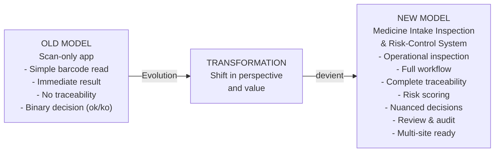

# Product Transformation Vision

## Overview

This diagram illustrates the fundamental shift in AuthMed's positioning and capability - from a simple barcode scanning application to a comprehensive medicine intake inspection and risk-control system.

## The Transformation

## What Changed

### Old Model: Scan-Only
- **Input:** Barcode scan
- **Process:** Database lookup
- **Output:** Accept/Reject
- **Documentation:** None
- **Traceability:** None
- **Decision Making:** Binary
- **Users:** One person, one app
- **Compliance:** Not supported

### New Model: Inspection & Risk-Control
- **Input:** Batch arrival + field inspection + evidence capture
- **Process:** Multi-step workflow with automated scoring and human review
- **Output:** Accept/Isolate/Escalate with detailed risk assessment
- **Documentation:** Complete with photos, notes, metadata
- **Traceability:** Full audit trail of all actions
- **Decision Making:** Nuanced with rule-based scoring and human judgment
- **Users:** Inspector + Reviewer + Manager + Quality Officer
- **Compliance:** Full compliance and auditability

## Strategic Implications

### Value Creation
1. **Risk Mitigation** - Intelligent scoring replaces binary decisions
2. **Auditability** - Every action is tracked for regulatory compliance
3. **Scalability** - Multi-site, multi-user architecture
4. **Efficiency** - Reduces inspection time from ~30min to ~5min
5. **Data-Driven** - KPI dashboards and trend analysis
6. **Extensibility** - Ready for ML/OCR integration

### Competitive Advantages
- Only solution offering complete audit trails
- Nuanced decision-making with human oversight
- Enterprise-ready for healthcare organizations
- Compliance-first architecture
- Mobile + Web + API ecosystem

### Market Positioning
- **Old:** "Medicine Scanner"
- **New:** "Quality Assurance Platform for Pharmaceutical Receiving"

---

## Next Steps

Review:
1. [Product Context](product-context.md) - See how AuthMed fits in the ecosystem
2. [Business Capability Map](business-capability-map.md) - Understand the feature set
3. [End-to-End Flow](end-to-end-product-flow.md) - Follow a complete inspection journey

---

**Impact:** This repositioning transforms AuthMed from a niche scanning tool to an enterprise quality-assurance platform.
