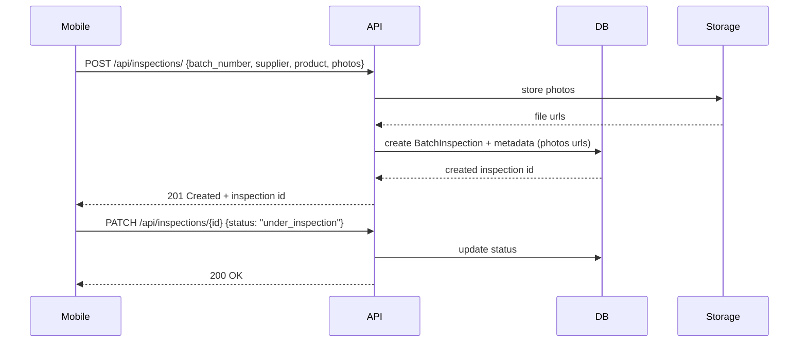

# Sequence 14a — Batch reception and inspection (Mobile)

**Résumé**
Séquence décrivant la réception d'un lot depuis l'application mobile jusqu'à l'enregistrement de l'inspection initiale.

```mermaid
sequenceDiagram
    participant Mobile
    participant API
    participant DB
    participant Storage
    Mobile->>API: POST /api/inspections/ {batch_number, supplier, product, photos}
    API->>Storage: store photos
    Storage-->>API: file urls
    API->>DB: create BatchInspection + metadata (photos urls)
    DB-->>API: created inspection id
    API-->>Mobile: 201 Created + inspection id
    Mobile->>API: PATCH /api/inspections/{id} {status: "under_inspection"}
    API->>DB: update status
    API-->>Mobile: 200 OK
```