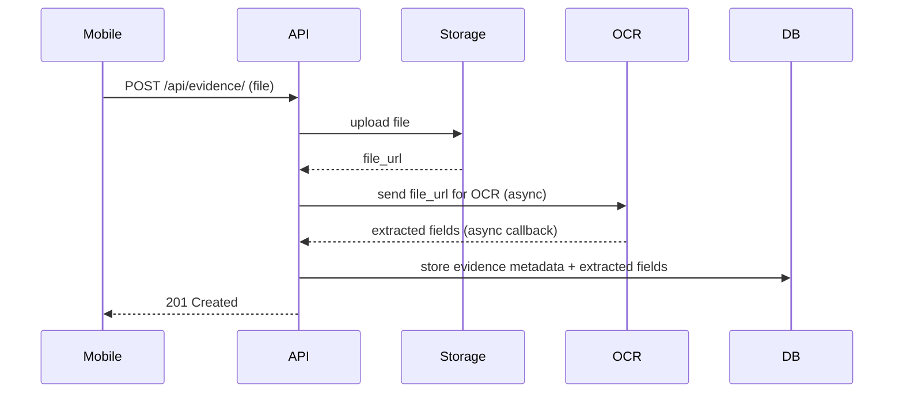

# Sequence 14b — Evidence upload and extraction

**Résumé**
Téléversement d'éléments de preuve (photos/docs), extraction optionnelle via OCR et enrichissement.

```mermaid
sequenceDiagram
    participant Mobile
    participant API
    participant Storage
    participant OCR
    participant DB
    Mobile->>API: POST /api/evidence/ (file)
    API->>Storage: upload file
    Storage-->>API: file_url
    API->>OCR: send file_url for OCR (async)
    OCR-->>API: extracted fields (async callback)
    API->>DB: store evidence metadata + extracted fields
    API-->>Mobile: 201 Created
```