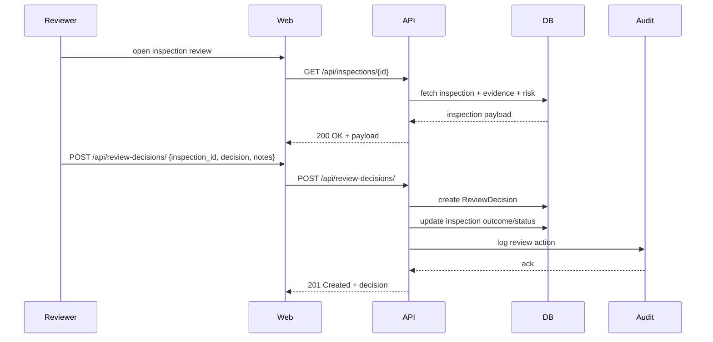

# Sequence 14d — Review decision flow

**Résumé**
Le reviewer examine l'inspection et prend une décision: accept / isolate / escalate.

```mermaid
sequenceDiagram
    participant Reviewer
    participant Web
    participant API
    participant DB
    participant Audit
    Reviewer->>Web: open inspection review
    Web->>API: GET /api/inspections/{id}
    API->>DB: fetch inspection + evidence + risk
    DB-->>API: inspection payload
    API-->>Web: 200 OK + payload
    Reviewer->>Web: POST /api/review-decisions/ {inspection_id, decision, notes}
    Web->>API: POST /api/review-decisions/
    API->>DB: create ReviewDecision
    API->>DB: update inspection outcome/status
    API->>Audit: log review action
    Audit-->>API: ack
    API-->>Web: 201 Created + decision
```