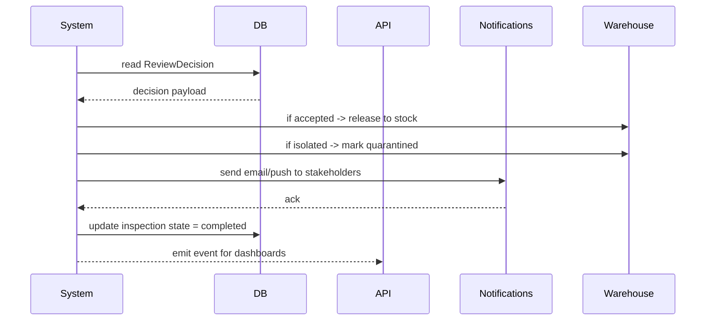

# Sequence 14e — Decision execution and notification

**Résumé**
Après décision, actions opérationnelles (libération en stock, isolement, ou escalade) et notifications.

```mermaid
sequenceDiagram
    participant System
    participant DB
    participant API
    participant Notifications
    participant Warehouse
    System->>DB: read ReviewDecision
    DB-->>System: decision payload
    System->>Warehouse: if accepted -> release to stock
    System->>Warehouse: if isolated -> mark quarantined
    System->>Notifications: send email/push to stakeholders
    Notifications-->>System: ack
    System->>DB: update inspection state = completed
    System-->>API: emit event for dashboards
```