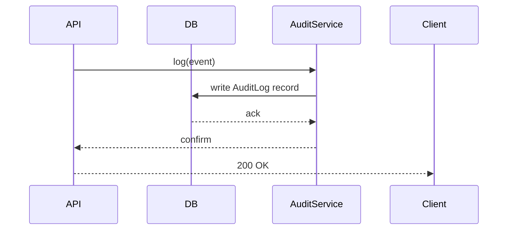

# Sequence 14f — Audit log and compliance

**Résumé**
Chaque action significative génère une entrée d'audit: création inspection, preuves ajoutées, score calculé, décision prise.

```mermaid
sequenceDiagram
    participant API
    participant DB
    participant AuditService
    API->>AuditService: log(event)
    AuditService->>DB: write AuditLog record
    DB-->>AuditService: ack
    AuditService-->>API: confirm
    API-->>Client: 200 OK
```