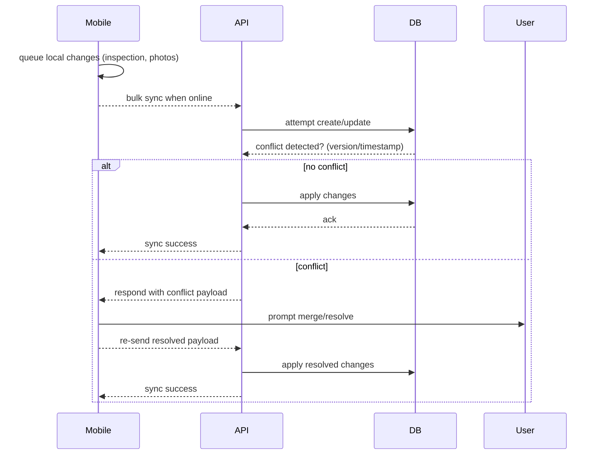

# Sequence 14g — Offline sync and conflict resolution

**Résumé**
Gestion des inspections créées hors-ligne sur mobile et synchronisation lorsque la connectivité revient, avec résolution de conflits simples.

