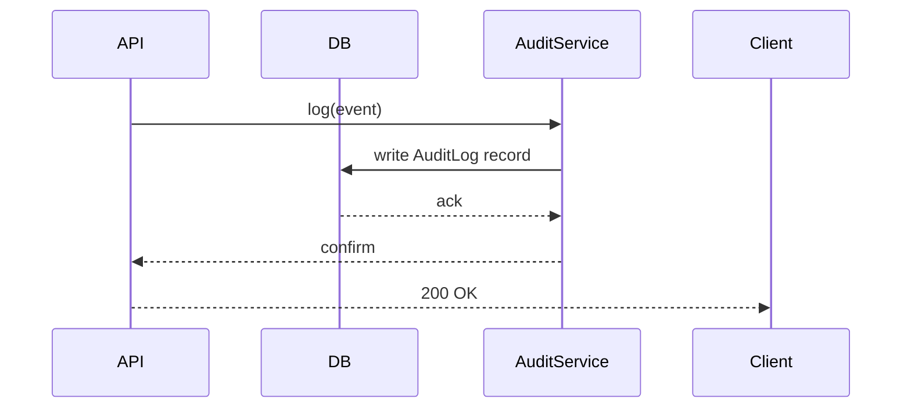

# Sequence — Audit Log and Compliance

**Summary**
Every significant action generates an `AuditLog` entry: inspection creation, evidence uploads, risk calculations, and decisions.

```mermaid
sequenceDiagram
    participant API
    participant DB
    participant AuditService
    API->>AuditService: log(event)
    AuditService->>DB: write AuditLog record
    DB-->>AuditService: ack
    AuditService-->>API: confirm
    API-->>Client: 200 OK
```
