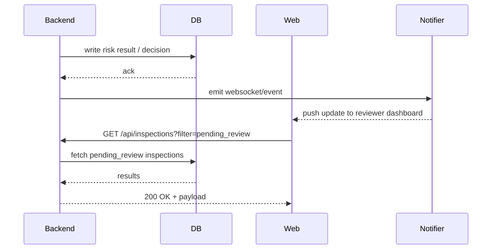

# Sequence — Dashboard Notification

**Résumé**
Comment les événements (scoring, decision) sont exposés au tableau de bord et aux reviewers.

```mermaid
sequenceDiagram
    participant Backend
    participant DB
    participant Web
    participant Notifier
    Backend->>DB: write risk result / decision
    DB-->>Backend: ack
    Backend->>Notifier: emit websocket/event
    Notifier-->>Web: push update to reviewer dashboard
    Web->>Backend: GET /api/inspections?filter=pending_review
    Backend->>DB: fetch pending_review inspections
    DB-->>Backend: results
    Backend-->>Web: 200 OK + payload
```
