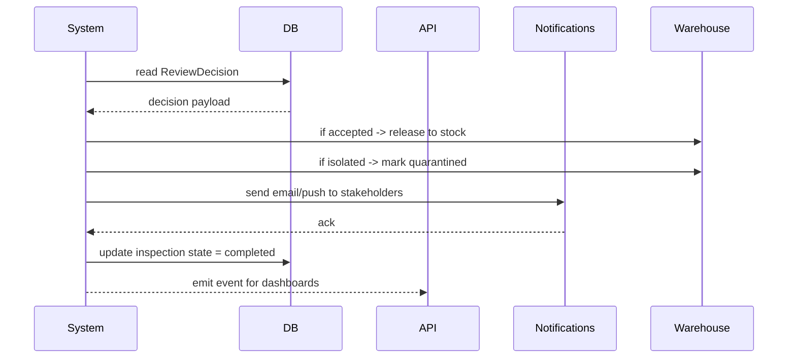

# Sequence — Decision Execution and Notification

**Summary**
After a decision is recorded, the system executes operational actions (release to stock, quarantine, or escalation) and sends notifications to stakeholders.

