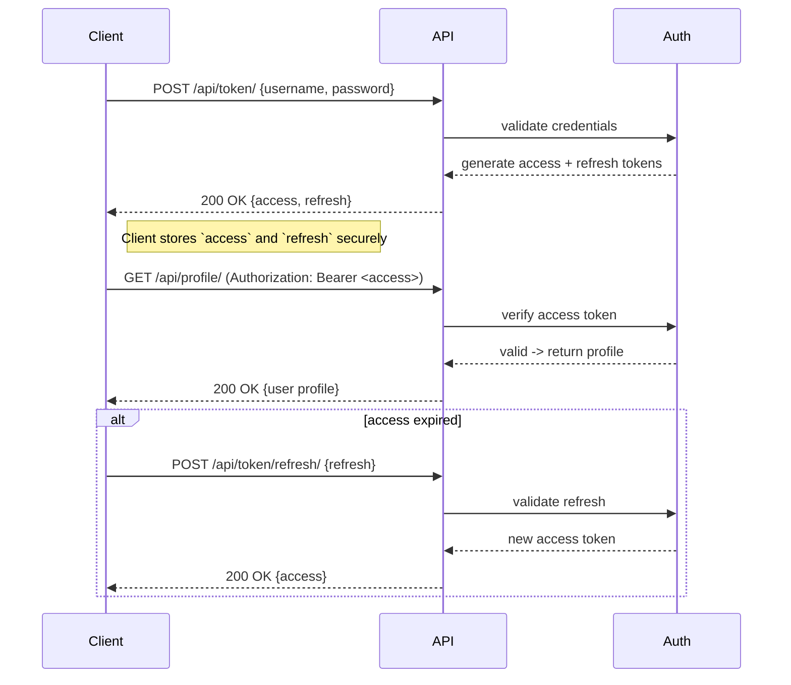

# Sequence — Login (JWT Authentication)

**Summary**
JWT authentication flow for mobile and web clients.

```mermaid
sequenceDiagram
    participant Client
    participant API
    participant Auth
    Client->>API: POST /api/token/ {username, password}
    API->>Auth: validate credentials
    Auth-->>API: generate access + refresh tokens
    API-->>Client: 200 OK {access, refresh}
    note right of Client: Client stores `access` and `refresh` securely
    Client->>API: GET /api/profile/ (Authorization: Bearer <access>)
    API->>Auth: verify access token
    Auth-->>API: valid -> return profile
    API-->>Client: 200 OK {user profile}
    
    alt access expired
        Client->>API: POST /api/token/refresh/ {refresh}
        API->>Auth: validate refresh
        Auth-->>API: new access token
        API-->>Client: 200 OK {access}
    end
```
