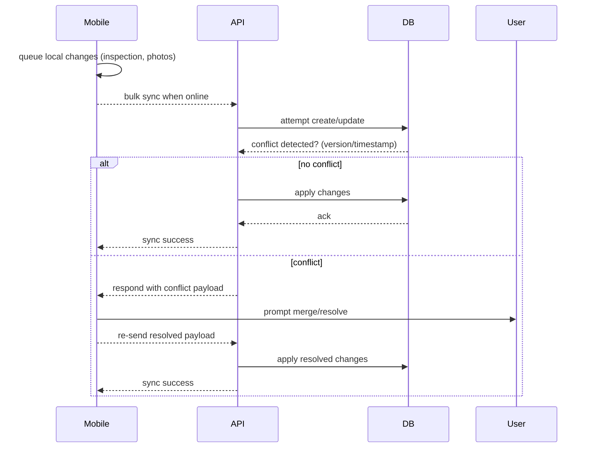

# Sequence — Offline Sync and Conflict Resolution

**Summary**
Handling of inspections created offline on the mobile client and synchronization when connectivity is restored, including simple conflict resolution.

