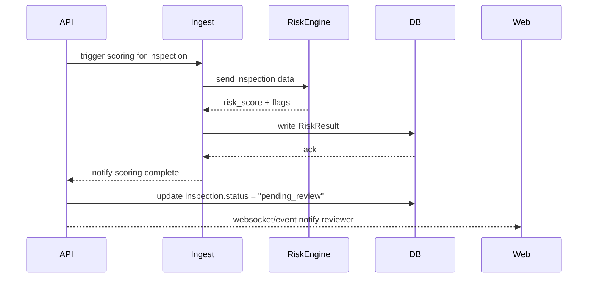

# Sequence — Risk Result

**Résumé**
Pipeline de scoring: déclenché après ingestion des données et/ou après extraction, le moteur de risque calcule et stocke un `RiskResult`.

```mermaid
sequenceDiagram
    participant API
    participant Ingest
    participant RiskEngine
    participant DB
    API->>Ingest: trigger scoring for inspection
    Ingest->>RiskEngine: send inspection data
    RiskEngine-->>Ingest: risk_score + flags
    Ingest->>DB: write RiskResult
    DB-->>Ingest: ack
    Ingest-->>API: notify scoring complete
    API->>DB: update inspection.status = "pending_review"
    API-->>Web: websocket/event notify reviewer
```
