# Activity Diagram (BPMN-style)

## Overview

This diagram shows the detailed activities, decisions, and flows for the complete batch inspection process in BPMN (Business Process Management Notation) style.

## Activity Flow Diagram

```mermaid
flowchart TD
    Start(["▶️ Lot Arrived"])
    
    Receive["📥 Reçu à la pharmacie"]
    Register["📋 Enregistrement lot<br/>- Lot number<br/>- Supplier<br/>- Product<br/>- Date/Heure"]
    
    RegisterOK{"ℹ️ Données<br/>complètes?"}
    
    RegisterErr["❌ Erreur saisie<br/>Corriger données"]
    RegisterOK -->|Non| RegisterErr
    RegisterErr --> Register
    
    InspectorAssign["🔍 Assignment inspecteur<br/>- Chercher inspecteur disponible<br/>- Envoyer notification<br/>- Status = Draft"]
    
    InspectorAck{"👥 Inspecteur<br/>accepte?"}
    
    InspectorWait["⏳ En attente inspecteur<br/>- Notifier inspecteur<br/>- Attendre réponse<br/>- Timeout 30 min"]
    
    InspectorAck -->|Non| InspectorWait
    InspectorWait --> InspectorAck
    
    FieldInspection["🏭 INSPECTION TERRAIN<br/>- Aller à warehouse<br/>- Localiser lot<br/>- Vérification identité<br/>- Observation physique"]
    
    CapturePhotos["📸 Capture photos<br/>- Exterior package<br/>- Labels/seals<br/>- Damage/anomalies<br/>- Storage conditions<br/>- Multiple angles"]
    
    RecordNotes["🖊️ Saisir observations<br/>- Conditions observées<br/>- Anomalies notées<br/>- Température/Humidité<br/>- Red flags"]
    
    UploadEvidence["☁️ Upload preuves<br/>- Photos to S3<br/>- Métadonnées<br/>- Timestamped<br/>- Validated"]
    
    EnterBatchData["🖊️ Saisir détails batch<br/>- Lot size<br/>- Manufacturing date<br/>- Expiration<br/>- Conditions<br/>- Anomalies"]
    
    ValidateData{"✅ Données<br/>valides?"}
    
    DataErr["❌ Erreur données<br/>Corriger"]
    ValidateData -->|Non| DataErr
    DataErr --> EnterBatchData
    
    SubmitInspection["✅ Soumettre inspection<br/>Status = Evidence Captured"]
    
    TriggerScoring["⚙️ Déclencher scoring<br/>- Backend job<br/>- Récupérer données<br/>- Appeler scoring engine"]
    
    RiskCalculation["⚠️ Calcul risque<br/>- Analyser conditions<br/>- Détecter anomalies<br/>- Appliquer règles<br/>- Score 0-100"]
    
    GenerateRecommendation["💡 Générer recommandation<br/>- Score < 20 → ACCEPT<br/>- Score 20-60 → ISOLATE<br/>- Score > 60 → ESCALATE"]
    
    NeedReview{"👁️ Revue humaine<br/>requise?<br/>Score 20-60?"}
    
    AutoApprove["✅ Auto-accepté<br/>Score < 20<br/>Status = Accepted"]
    AutoEscalate["🔴 Auto-escaladé<br/>Score > 60<br/>Notify management"]
    
    NeedReview -->|Non| AutoApprove
    NeedReview -->|Oui| ReviewQueue
    NeedReview -->|High Risk| AutoEscalate
    
    ReviewQueue["📋 QUEUE DE RÉVISION<br/>- Ajouter à queue reviewer<br/>- Priority = risk score<br/>- Status = Pending Review"]
    
    ReviewerAssign["👁️ Assignation reviewer<br/>- Assigner reviewer dispo<br/>- Envoyer notification<br/>- Priority sort"]
    
    ReviewerOpen["📖 Reviewer lit inspection<br/>- Voir photos<br/>- Lire notes inspecteur<br/>- Voir score risque<br/>- Voir historique supplier"]
    
    ReviewEvaluate["🔍 Évaluer décision<br/>- Analyser preuves<br/>- Vérifier anomalies<br/>- Valider score<br/>- Juger acceptable?"]
    
    ReviewDecide{"👁️ Approbation<br/>reviewer?"}
    
    ReviewApprove["✅ Approuvé<br/>Decision = Accepted"]
    ReviewIsolate["⚠️ Isoler<br/>Decision = Isolated<br/>Raison noted"]
    ReviewEscalate["🔴 Escalader<br/>Decision = Escalated<br/>Notify management"]
    
    ReviewDecide -->|ACCEPT| ReviewApprove
    ReviewDecide -->|ISOLATE| ReviewIsolate
    ReviewDecide -->|ESCALATE| ReviewEscalate
    
    RecordDecision["🔗 Enregistrer décision<br/>- Audit log entry<br/>- Timestamp<br/>- Actor = reviewer<br/>- Decision + notes"]
    
    ReviewApprove --> RecordDecision
    ReviewIsolate --> RecordDecision
    ReviewEscalate --> RecordDecision
    AutoApprove --> RecordDecision
    AutoEscalate --> RecordDecision
    
    ExecuteDecision{"⚙️ Exécuter<br/>décision"}
    
    ExecAccept["✓ ACCEPTÉ<br/>- Lot released<br/>- Moved to storage<br/>- Available for use<br/>- Notify pharmacy"]
    
    ExecIsolate["⚠️ ISOLÉ<br/>- Batch quarantined<br/>- Mark Do Not Use<br/>- Notify QA<br/>- Pending investigation"]
    
    ExecEscalate["🔴 ESCALADÉ<br/>- Batch held<br/>- Notify director<br/>- Investigate<br/>- Potential reject"]
    
    ExecuteDecision -->|ACCEPT| ExecAccept
    ExecuteDecision -->|ISOLATE| ExecIsolate
    ExecuteDecision -->|ESCALATE| ExecEscalate
    
    UpdateDashboard["📊 Mettre à jour KPI<br/>- Total processed<br/>- Acceptance rate<br/>- Rejection rate<br/>- Trends"]
    
    Archive["📦 Archiver inspection<br/>- Mark completed<br/>- Evidence immutable<br/>- Audit trail sealed<br/>- Searchable"]
    
    End(["✅ INSPECTION COMPLÈTE"])
    
    Start --> Receive
    Receive --> Register
    Register --> RegisterOK
    RegisterOK -->|Oui| InspectorAssign
    InspectorAssign --> InspectorAck
    InspectorAck -->|Oui| FieldInspection
    FieldInspection --> CapturePhotos
    CapturePhotos --> RecordNotes
    RecordNotes --> UploadEvidence
    UploadEvidence --> EnterBatchData
    EnterBatchData --> ValidateData
    ValidateData -->|Oui| SubmitInspection
    SubmitInspection --> TriggerScoring
    TriggerScoring --> RiskCalculation
    RiskCalculation --> GenerateRecommendation
    GenerateRecommendation --> NeedReview
    AutoApprove --> ExecuteDecision
    AutoEscalate --> ExecuteDecision
    ReviewQueue --> ReviewerAssign
    ReviewerAssign --> ReviewerOpen
    ReviewerOpen --> ReviewEvaluate
    ReviewEvaluate --> ReviewDecide
    ReviewApprove --> RecordDecision
    ReviewIsolate --> RecordDecision
    ReviewEscalate --> RecordDecision
    RecordDecision --> ExecuteDecision
    ExecAccept --> UpdateDashboard
    ExecIsolate --> UpdateDashboard
    ExecEscalate --> UpdateDashboard
    UpdateDashboard --> Archive
    Archive --> End
    
    style Start fill:#27ae60,color:#fff,stroke-width:3px
    style End fill:#27ae60,color:#fff,stroke-width:3px
    style ReviewQueue fill:#9b59b6,color:#fff
    style ReviewerAssign fill:#8e44ad,color:#fff
    style ReviewerOpen fill:#8e44ad,color:#fff
    style ReviewEvaluate fill:#8e44ad,color:#fff
    style ReviewDecide fill:#8e44ad,color:#fff
    style TriggerScoring fill:#e67e22,color:#fff
    style RiskCalculation fill:#e67e22,color:#fff
    style GenerateRecommendation fill:#e67e22,color:#fff
    style RecordDecision fill:#16a085,color:#fff
    style ExecuteDecision fill:#27ae60,color:#fff
    style UpdateDashboard fill:#2980b9,color:#fff
    style Archive fill:#34495e,color:#fff
```



## Activity Details

### 1. Reception & Registration Phase

**Activity: Receive**
- Triggered by: Batch physically arrives
- Duration: < 1 minute
- Responsibility: Receiving clerk
- Output: Batch physically in facility

**Activity: Register**
- Triggered by: Batch received
- Duration: 1-2 minutes
- Responsibility: Receiving clerk or admin
- Required inputs:
  - Batch/lot number
  - Supplier (from dropdown)
  - Product (from dropdown)
  - Quantity received
  - Date/time received
- Validation: All fields required and valid
- Output: Batch record created, Status = "Draft"

**Decision: Data complete?**
- If NO: Return to Register, correct data
- If YES: Continue to Inspector assignment

**Activity: Inspector Assignment**
- Duration: < 1 minute
- Responsibility: System (automated)
- Steps:
  1. Query available inspectors for site
  2. Select inspector (by workload, proximity, availability)
  3. Send push notification to inspector mobile app
  4. Create assignment record
  5. Status → "Assigned"
- Output: Inspector notified, assignment recorded

**Decision: Inspector accepts?**
- If NO: Retry queue, wait 30 min, try next inspector
- If YES: Continue to field inspection

---

### 2. Field Inspection Phase

**Activity: Field Inspection**
- Triggered by: Inspector accepts assignment
- Duration: 1-2 minutes
- Responsibility: Inspector
- Location: Physical warehouse/receiving area
- Steps:
  1. Inspector travels to receiving area
  2. Locates batch using lot number
  3. Verifies batch identity matches system record
  4. Visually inspects packaging:
     - Check seal integrity
     - Look for damage
     - Check for contamination signs
     - Observe label clarity
  5. Assesses storage conditions:
     - Temperature (if thermometer available)
     - Humidity (if sensor available)
     - Storage area condition
  6. Notes any deviations
- Output: Physical inspection complete

---

### 3. Evidence Capture Phase

**Activity: Capture Photos**
- Triggered by: Physical inspection complete
- Duration: 1-2 minutes
- Responsibility: Inspector (mobile app)
- Steps:
  1. Open mobile app, tap "Capture Evidence"
  2. Take photo of package exterior (full view)
  3. Take close-up of labels and lot markings
  4. Take close-up of seals
  5. Photograph any damage or anomalies
  6. Photograph storage area (if relevant)
  7. Can record short video (optional)
- Output: Photos captured with timestamps and geolocation

**Activity: Record Notes**
- Triggered by: Photos captured
- Duration: 1-2 minutes
- Responsibility: Inspector
- Content:
  - Physical observations (condition, integrity)
  - Any anomalies or red flags
  - Environmental factors (temperature, humidity)
  - Inspector concerns or observations
- Output: Notes recorded with timestamp

**Activity: Upload Evidence**
- Triggered by: Photos and notes ready
- Duration: < 1 minute (depends on network)
- Responsibility: Mobile app (automatic)
- Steps:
  1. Compress photos if needed
  2. Upload to S3 object storage
  3. Verify upload successful
  4. Create Evidence records in database
  5. Link to batch inspection
- Output: Evidence stored, metadata in database

---

### 4. Data Extraction Phase

**Activity: Enter Batch Data**
- Triggered by: Evidence uploaded
- Duration: 1-2 minutes
- Responsibility: Inspector
- Data entered:
  - Manufacturing date (if on package)
  - Expiration date
  - Batch/lot size
  - Observed conditions summary
  - Any anomalies noted
  - Product confirmation (matches expected?)
- Output: Complete batch data record

**Decision: Data valid?**
- Validation checks:
  - All required fields filled
  - Data types correct
  - No future dates
  - Expiration > today
  - Quantity > 0
- If NO: Return to Enter Batch Data, correct errors
- If YES: Continue to submit

**Activity: Submit Inspection**
- Triggered by: Data validated
- Duration: < 1 minute
- Responsibility: Inspector
- Steps:
  1. Review all data one more time
  2. Click "Submit Inspection"
  3. System locks batch for further editing (read-only)
  4. Status → "Submitted"
  5. Backend job triggered
- Output: Inspection submitted, ready for scoring

---

### 5. Scoring Phase

**Activity: Trigger Scoring**
- Triggered by: Inspection submitted
- Duration: < 1 second
- Responsibility: System (automated, async job)
- Steps:
  1. Background job picks up submission
  2. Retrieves all batch data
  3. Retrieves product info from reference library
  4. Retrieves supplier historical data
  5. Calls risk scoring engine API
- Output: Scoring job initiated

**Activity: Risk Calculation**
- Triggered by: Scoring job initiated
- Duration: 2-5 seconds
- Responsibility: Risk Scoring Engine
- Scoring factors:
  - **Condition factors (40%)**
    - Package seal integrity
    - Packaging damage
    - Storage temperature exposure
  - **Observable anomalies (30%)**
    - Contamination signs
    - Discoloration
    - Leakage
    - Structural damage
  - **Supplier history (20%)**
    - Past rejection rate
    - Quality score
    - Reliability ranking
  - **Product risk category (10%)**
    - High-risk products get higher baseline
    - Specialty items weighted differently
- Output: Numeric score (0-100) with factor breakdown

**Activity: Generate Recommendation**
- Triggered by: Score calculated
- Duration: < 1 second
- Responsibility: Decision Engine
- Logic:
  - If score < 20: Recommend "ACCEPT"
  - If score 20-60: Recommend "ISOLATE"
  - If score > 60: Recommend "ESCALATE"
- Output: Recommendation + score stored in RiskResult

---

### 6. Decision Routing Phase

**Decision: Review needed? (Score 20-60?)**
- If score < 20 (low risk):
  - → Auto-Approve path
  - Status → "Accepted"
- If score 20-60 (medium risk):
  - → Review Queue (human review required)
  - Status → "Pending Review"
- If score > 60 (high risk):
  - → Auto-Escalate path
  - Notify management immediately
  - Status → "Escalated"

**Activity: Auto-Approve (Score < 20)**
- Duration: < 1 second
- Responsibility: System (automated)
- Steps:
  1. System automatically approves batch
  2. Creates ReviewDecision record
  3. Status → "Accepted"
  4. Executes acceptance actions
  5. Reviewer may spot-check but not required
- Output: Batch accepted, no human intervention needed

**Activity: Auto-Escalate (Score > 60)**
- Duration: < 1 second
- Responsibility: System (automated)
- Steps:
  1. System automatically escalates
  2. Creates ReviewDecision record with escalate flag
  3. Sends urgent notification to management
  4. Status → "Escalated"
  5. Management must investigate
- Output: Batch escalated for investigation

---

### 7. Review Queue & Human Review Phase (If needed)

**Activity: Review Queue**
- Triggered by: Score in medium range (20-60)
- Duration: Continuous process
- Responsibility: System queue manager
- Steps:
  1. Add inspection to reviewer's queue
  2. Calculate priority (higher score = higher priority)
  3. Show inspection in reviewer dashboard
  4. Wait for reviewer assignment
  5. Status → "Pending Review"
- Output: Inspection queued for review

**Activity: Reviewer Assignment**
- Duration: < 1 second
- Responsibility: System (automated load balancing)
- Steps:
  1. Identify available reviewers
  2. Assign to reviewer with lowest current queue
  3. Send notification to reviewer
  4. Create assignment record
- Output: Reviewer notified of pending review

**Activity: Reviewer Open Inspection**
- Duration: 1-2 minutes
- Responsibility: Reviewer (dashboard)
- Steps:
  1. Reviewer opens dashboard
  2. Sees inspection in their queue (priority sorted)
  3. Clicks on inspection to open
  4. Views:
     - All evidence photos
     - Inspector notes
     - Risk score breakdown
     - Supplier history
     - Product info
  5. Can zoom photos, read full notes, scroll through evidence
- Output: Full visibility into batch inspection

**Activity: Reviewer Evaluate**
- Duration: 2-5 minutes
- Responsibility: Reviewer (expert judgment)
- Questions reviewer asks:
  - Are the observations consistent with the risk score?
  - Is the risk score justified by the evidence?
  - Are there any concerns the inspector missed?
  - Is this batch acceptable for use?
  - Should it be isolated for further analysis?
  - Is escalation to management warranted?
- Reviewer may:
  - Approve the recommendation
  - Override the recommendation
  - Request additional inspection
  - Add notes/comments
- Output: Reviewer judgment recorded

**Decision: Approval?**
- Reviewer decides:
  - ACCEPT: Batch is safe, approve for stock
  - ISOLATE: Batch needs further analysis, quarantine
  - ESCALATE: Batch is rejected, investigate and contact supplier
- Output: Final decision made

---

### 8. Record Audit Phase

**Activity: Record Decision**
- Triggered by: Decision made (auto or human)
- Duration: < 1 second
- Responsibility: Audit service (automated)
- Steps:
  1. Create AuditLog entry for decision
  2. Record:
     - Actor: Who made decision (user ID)
     - Action: Decision made
     - Timestamp: When decided
     - Details: Which decision (Accept/Isolate/Escalate)
     - Notes: Justification/comments
     - Override: Was AI recommendation overridden?
  3. Create immutable audit record
  4. Status → "Execution Pending"
- Output: Complete audit trail created

---

### 9. Execution Phase

**Decision: Execute Decision**
- Based on ReviewDecision.decision field
- Routes to appropriate execution path

**Activity: Execute Accept**
- Triggered by: Batch accepted (final decision)
- Duration: 5-10 minutes
- Responsibility: Logistics/Warehouse staff
- Steps:
  1. Receive notification: "Batch approved"
  2. Locate batch in receiving area
  3. Move batch to appropriate storage location
  4. Update warehouse system
  5. Make batch available for dispensing
  6. Notify pharmacy staff
  7. Status → "Accepted"
- Output: Batch released to stock, available for use

**Activity: Execute Isolate**
- Triggered by: Batch isolated (final decision)
- Duration: 5-10 minutes
- Responsibility: Logistics/Warehouse staff
- Steps:
  1. Receive notification: "Batch isolated"
  2. Locate batch
  3. Move to quarantine area
  4. Mark with "Do Not Dispense" flag
  5. Notify Quality Officer
  6. Status → "Isolated"
  7. Pending further investigation or observation
- Output: Batch quarantined, awaiting follow-up

**Activity: Execute Escalate**
- Triggered by: Batch escalated (high risk or reviewer decision)
- Duration: 5-30 minutes (investigation ongoing)
- Responsibility: Management/Director
- Steps:
  1. Receive urgent notification: "Batch escalated"
  2. Director reviews evidence and risk analysis
  3. Initiates investigation:
     - Contact supplier?
     - Request additional testing?
     - Contact regulatory body?
  4. Document findings
  5. Make final decision: Reject or Accept with conditions?
  6. Status → "Escalated" (investigation ongoing)
- Output: Escalation path opened, management engaged

---

### 10. Dashboard & Archival Phase

**Activity: Update Dashboard**
- Triggered by: Execution complete
- Duration: < 1 second
- Responsibility: System (automated)
- Updates:
  - Total batches processed (increment)
  - Acceptance count (increment if accepted)
  - Isolation count (increment if isolated)
  - Escalation count (increment if escalated)
  - Average risk score (recalculate)
  - Supplier performance metrics
  - Product risk distribution
  - KPI dashboards refresh
- Output: Real-time KPI updated, visible to managers

**Activity: Archive Inspection**
- Triggered by: Dashboard updated
- Duration: < 1 second
- Responsibility: System (automated)
- Steps:
  1. Mark batch as "Completed"
  2. Archive evidence files (S3)
  3. Archive metadata (database)
  4. Seal audit trail (immutable)
  5. Index for search/compliance
  6. Status → "Archived"
- Output: Inspection permanently recorded and searchable

---

## Timelines

### Fast Path (Score < 20)
```
Registration (2 min)
+ Field Inspection (2 min)
+ Evidence (2 min)
+ Data Extraction (1 min)
+ Scoring (< 1 sec, auto-approve)
+ Execution (5 min)
────────────────────────
TOTAL: ~12-15 minutes
```

### Standard Path (Score 20-60)
```
Registration (2 min)
+ Field Inspection (2 min)
+ Evidence (2 min)
+ Data Extraction (1 min)
+ Scoring (< 1 sec)
+ Review Queue (waiting)
+ Human Review (2-5 min)
+ Execution (5 min)
────────────────────────
TOTAL: ~15-20 minutes (or longer if reviewer busy)
```

### Escalation Path (Score > 60)
```
Registration (2 min)
+ Field Inspection (2 min)
+ Evidence (2 min)
+ Data Extraction (1 min)
+ Scoring (< 1 sec, auto-escalate)
+ Management Action (15-30 min)
+ Execution (5-10 min)
────────────────────────
TOTAL: ~30-50 minutes (investigation included)
```

---

## Next Steps

See:
1. [Batch Inspection State Machine](batch-inspection-state-machine.md) - State diagram
2. [Sequence Diagrams](../sequences/) - Technical implementation
3. [API Endpoints](../architecture/api-endpoints.md) - How to trigger activities

---

**Key Insight:** Each activity is well-defined with clear inputs, outputs, duration, and responsibility. This enables clear measurement and process improvement.
