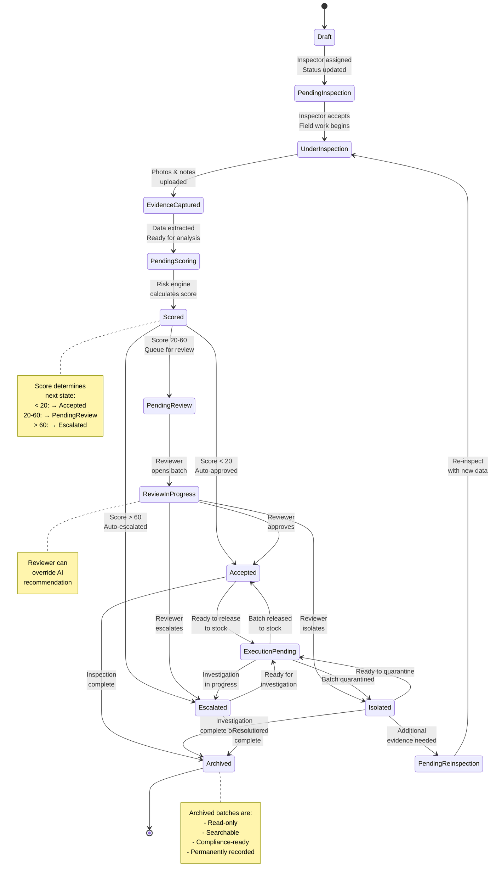

# Batch Inspection State Machine

## Overview

This diagram shows all possible states of a batch inspection and the valid transitions between states. It illustrates how a batch moves through the inspection lifecycle.

## State Machine Diagram



## State Descriptions

### Draft
**Description:** Batch registered but inspector not yet assigned  
**Entry Condition:** Batch created in system  
**Exit Condition:** Inspector assigned  
**Status Value:** "draft"  
**Characteristics:**
- Batch metadata entered
- No inspection yet
- Can be edited
- No evidence captured
- No decision made

**Duration:** < 1 minute typically  
**Timeout:** None (waits for inspector)

**Valid Transitions:**
- → PendingInspection (when inspector assigned)

---

### PendingInspection
**Description:** Inspector assigned, awaiting acceptance and field work  
**Entry Condition:** Inspector assigned to batch  
**Exit Condition:** Inspector accepts and begins field inspection  
**Status Value:** "pending_inspection"  
**Characteristics:**
- Inspector notified via mobile app
- Waiting for inspector to acknowledge
- Batch info available to inspector
- No field work started yet

**Duration:** 5-30 minutes (depends on inspector availability)  
**Timeout:** 30 minutes, then reassign to another inspector

**Valid Transitions:**
- → UnderInspection (when inspector starts work)
- → Draft (if need to reassign)

---

### UnderInspection
**Description:** Inspector actively conducting field inspection  
**Entry Condition:** Inspector taps "Start Inspection" in mobile app  
**Exit Condition:** Evidence captured and data extracted  
**Status Value:** "under_inspection"  
**Characteristics:**
- Physical inspection in progress
- Inspector at warehouse/receiving area
- Photos being taken
- Notes being recorded
- Evidence uploading

**Duration:** 2-5 minutes typically  
**Timeout:** None (manual process)

**Valid Transitions:**
- → EvidenceCaptured (when field work complete)
- → PendingInspection (if canceled by inspector)

---

### EvidenceCaptured
**Description:** Photos and evidence uploaded, awaiting data extraction  
**Entry Condition:** Evidence files uploaded to S3  
**Exit Condition:** Batch data extracted and validated  
**Status Value:** "evidence_captured"  
**Characteristics:**
- All photos stored
- Timestamps recorded
- Ready for data entry
- No analysis yet
- Can review photos

**Duration:** < 1 minute typically  
**Timeout:** Auto-transition to PendingScoring if data entry not started within 5 minutes

**Valid Transitions:**
- → PendingScoring (when batch data extracted and validated)
- → UnderInspection (if additional evidence needed)

---

### PendingScoring
**Description:** Data extracted, awaiting risk scoring  
**Entry Condition:** All batch data validated and entered  
**Exit Condition:** Risk engine completes scoring  
**Status Value:** "pending_scoring"  
**Characteristics:**
- Complete batch information available
- Evidence captured
- No risk analysis yet
- Queued for scoring
- Awaiting backend job

**Duration:** < 5 seconds typically  
**Timeout:** None (auto-processes)

**Valid Transitions:**
- → Scored (when scoring engine completes)

---

### Scored
**Description:** Risk score calculated, decision routing pending  
**Entry Condition:** Risk engine completes scoring  
**Exit Condition:** Batch routed to appropriate next state  
**Status Value:** "scored"  
**Characteristics:**
- Risk score calculated (0-100)
- Risk factors analyzed
- Anomalies detected
- Initial recommendation generated
- Ready for decision

**Duration:** < 1 second typically  
**Timeout:** None (auto-transitions)

**Valid Transitions:**
- → Accepted (if score < 20, auto-approved)
- → PendingReview (if score 20-60, requires human review)
- → Escalated (if score > 60, auto-escalated)

---

### PendingReview
**Description:** Medium-risk batch queued for human reviewer approval  
**Entry Condition:** Score between 20-60  
**Exit Condition:** Reviewer examines evidence and makes decision  
**Status Value:** "pending_review"  
**Characteristics:**
- Batch in reviewer's queue
- Awaiting human judgment
- Evidence ready to review
- Risk score available
- Supplier history visible

**Duration:** 30 minutes to 1 day (depends on queue)  
**Timeout:** None (waits for reviewer)

**Valid Transitions:**
- → ReviewInProgress (when reviewer opens batch)
- → UnderInspection (if re-inspection needed)

---

### ReviewInProgress
**Description:** Reviewer actively examining evidence and making decision  
**Entry Condition:** Reviewer opens batch in dashboard  
**Exit Condition:** Reviewer submits decision  
**Status Value:** "review_in_progress"  
**Characteristics:**
- Reviewer viewing evidence
- Examining photos and notes
- Can drill into risk calculation
- Can see supplier history
- Making determination

**Duration:** 2-5 minutes typically  
**Timeout:** None (manual process)

**Valid Transitions:**
- → Accepted (reviewer approves)
- → Isolated (reviewer isolates)
- → Escalated (reviewer escalates)
- → PendingReinspection (reviewer requests re-inspection)

---

### Accepted
**Description:** Batch approved for use, ready for execution/stock  
**Entry Condition:** Auto-approved (score < 20) OR Reviewer approved  
**Exit Condition:** Batch released to stock  
**Status Value:** "accepted"  
**Characteristics:**
- Final decision made
- Approved for dispensing
- Awaiting warehouse action
- Evidence archived
- Audit trail complete

**Duration:** 5-15 minutes (warehouse execution)  
**Timeout:** None

**Valid Transitions:**
- → ExecutionPending (batch ready to move to stock)
- → Archived (batch released and logged)

---

### Isolated
**Description:** Batch flagged for further investigation or observation  
**Entry Condition:** Score 20-60 with reviewer isolation OR Score < 20 but reviewer overrides  
**Exit Condition:** Further analysis complete or abandoned  
**Status Value:** "isolated"  
**Characteristics:**
- Batch quarantined
- Do Not Dispense flag
- Awaiting investigation
- Quality officer notified
- Decision not final

**Duration:** Days to weeks (investigation ongoing)  
**Timeout:** None (manual investigation)

**Valid Transitions:**
- → ExecutionPending (further testing complete)
- → PendingReinspection (need to re-inspect)
- → Archived (isolation abandoned, batch accepted or rejected)

---

### Escalated
**Description:** High-risk batch escalated for management investigation  
**Entry Condition:** Auto-escalated (score > 60) OR Reviewer escalates  
**Exit Condition:** Investigation complete, decision made  
**Status Value:** "escalated"  
**Characteristics:**
- Batch held immediately
- Management notified urgently
- Investigation initiated
- Potential supplier contact
- Potential regulatory reporting
- Potential rejection

**Duration:** Hours to days (investigation)  
**Timeout:** None

**Valid Transitions:**
- → ExecutionPending (investigation complete, decision made)
- → PendingReinspection (need additional field inspection)
- → Archived (resolution complete)

---

### ExecutionPending
**Description:** Decision final, awaiting physical execution  
**Entry Condition:** Batch accepted/isolated/escalated, ready for action  
**Exit Condition:** Warehouse action complete  
**Status Value:** "execution_pending"  
**Characteristics:**
- Final decision determined
- Awaiting warehouse staff action
- Ready to release or quarantine
- Notification sent to logistics
- No data changes allowed

**Duration:** 5-10 minutes  
**Timeout:** None

**Valid Transitions:**
- → Accepted (batch released to stock)
- → Isolated (batch quarantined)
- → Escalated (investigation continues)
- → Archived (action complete)

---

### PendingReinspection
**Description:** Additional inspection requested before final decision  
**Entry Condition:** Reviewer or QA requests re-inspection  
**Exit Condition:** Re-inspection completed and data re-extracted  
**Status Value:** "pending_reinspection"  
**Characteristics:**
- Additional field work needed
- New evidence to be captured
- Previous evidence retained
- Same or different inspector may revisit
- May reveal new information

**Duration:** Hours to days (scheduling)  
**Timeout:** None

**Valid Transitions:**
- → UnderInspection (re-inspection begins)
- → Archived (re-inspection abandoned)

---

### Archived
**Description:** Inspection complete and permanently recorded  
**Entry Condition:** All actions complete and batch final state reached  
**Exit Condition:** None (terminal state)  
**Status Value:** "archived"  
**Characteristics:**
- Read-only (no further changes)
- All evidence sealed
- Audit trail immutable
- Searchable by batch ID, supplier, product, date
- Compliance-ready
- Permanently stored
- Available for regulatory audit
- Supports traceability (recall scenarios)

**Duration:** Permanent  
**Timeout:** None

**Valid Transitions:**
- → None (terminal state, but can be searched/reviewed)

---

## State Machine Rules

### Valid State Sequences

**Happy Path (Low Risk):**
```
Draft → PendingInspection → UnderInspection → EvidenceCaptured → 
PendingScoring → Scored → Accepted → Archived
(Duration: ~5-15 minutes)
```

**Standard Path (Medium Risk):**
```
Draft → PendingInspection → UnderInspection → EvidenceCaptured → 
PendingScoring → Scored → PendingReview → ReviewInProgress → 
Accepted → Archived
(Duration: ~15-30 minutes + review time)
```

**Escalation Path (High Risk):**
```
Draft → PendingInspection → UnderInspection → EvidenceCaptured → 
PendingScoring → Scored → Escalated → [Investigation] → Archived
(Duration: Hours to days)
```

**Isolation Path:**
```
... → Scored → PendingReview → ReviewInProgress → Isolated → 
[Further Analysis] → Archived
(Duration: Days to weeks)
```

**Re-inspection Path:**
```
PendingReview → ReviewInProgress → PendingReinspection → 
UnderInspection → EvidenceCaptured → PendingScoring → ...
```

### Invariants

1. **No backward transitions:** Batch cannot go back to previous decision states
2. **Single path forward:** At each decision point, exactly one path is chosen
3. **Terminal state:** Archived is final, no escape
4. **One active state:** Batch in exactly one state at any time
5. **Timestamps:** Every state transition timestamped and audited
6. **Immutability:** Once archived, batch data cannot be modified

### Invalid Transitions

These are NOT allowed:
- Scored → Draft (no going back)
- Accepted → PendingReview (decision is final)
- Archived → Any (no exiting archived state)
- ExecutionPending → PendingScoring (no re-analysis)

---

## Timeout Handling

| State | Timeout | Action |
|-------|---------|--------|
| PendingInspection | 30 min | Reassign to another inspector |
| UnderInspection | None | Manual process, no timeout |
| EvidenceCaptured | 5 min | Auto-advance to PendingScoring if data entered |
| PendingScoring | None | Auto-processes in seconds |
| PendingReview | 24 hours | Escalate to QA if no review action |
| ReviewInProgress | 1 hour | Notify reviewer of long-in-progress batches |
| Isolated | 7 days | Notify QA if no action taken |
| Escalated | 3 hours | Escalate to director if no investigation started |
| ExecutionPending | 2 hours | Notify warehouse manager |

---

## Event Logging

Every state transition is logged with:
- **From State:** Previous state
- **To State:** New state
- **Timestamp:** When transition occurred
- **Actor:** Who/what triggered transition (user ID or "system")
- **Reason:** Why transition occurred (auto-approve, reviewer decision, timeout, etc.)
- **Details:** Additional context (score value, notes, etc.)

Example log entries:
```
2026-05-19 14:23:15 | Draft → PendingInspection | system | Inspector assigned: john.doe@auth.med | Batch#LOT-20260519-001
2026-05-19 14:25:42 | PendingInspection → UnderInspection | john.doe | Inspector accepted assignment | Mobile app
2026-05-19 14:31:20 | EvidenceCaptured → PendingScoring | system | Data validated | 5 photos, 3 notes
2026-05-19 14:31:25 | PendingScoring → Scored | system | Risk score calculated | Score: 35/100
2026-05-19 14:31:26 | Scored → PendingReview | system | Score in review range | 20-60
2026-05-19 14:45:18 | PendingReview → ReviewInProgress | jane.smith | Reviewer opened batch | Dashboard
2026-05-19 14:52:03 | ReviewInProgress → Accepted | jane.smith | Reviewer decision | "Evidence matches score, approved"
2026-05-19 15:02:45 | Accepted → Archived | system | Batch released to stock | Warehouse executed decision
```

---

## Batch Lifecycle Diagram

```
Inspection Lifecycle:
├── CREATION (Minutes 0-2)
│   └── Draft → PendingInspection
│
├── FIELD WORK (Minutes 2-5)
│   └── UnderInspection → EvidenceCaptured
│
├── ANALYSIS (Minutes 5-6)
│   └── PendingScoring → Scored
│
├── ROUTING (Seconds 6-7)
│   ├── Auto-approval (Score < 20) → Accepted
│   ├── Review queue (Score 20-60) → PendingReview
│   └── Auto-escalate (Score > 60) → Escalated
│
├── HUMAN JUDGMENT (If needed, Minutes 7-15+)
│   └── ReviewInProgress → [Accepted/Isolated/Escalated]
│
├── EXECUTION (Minutes 15-25)
│   └── ExecutionPending → [Final State]
│
└── ARCHIVE (Minutes 25-30)
    └── Archived (TERMINAL)

Total: 5-30 minutes depending on pathway
```

---

## Next Steps

See:
1. [Business Workflow](business-workflow.md) - How states fit into overall workflow
2. [Activity Diagram](activity-diagram.md) - Detailed activities at each state
3. [Data Model](../data-model/domain-model.md) - Status field implementation

---

**Key Insight:** State machine ensures clear, auditable progression through inspection lifecycle. Every transition is tracked, logged, and immutable once complete.

**Implementation Note:** Status field in BatchInspection model must match these states exactly. Transitions enforced at API and model level.
