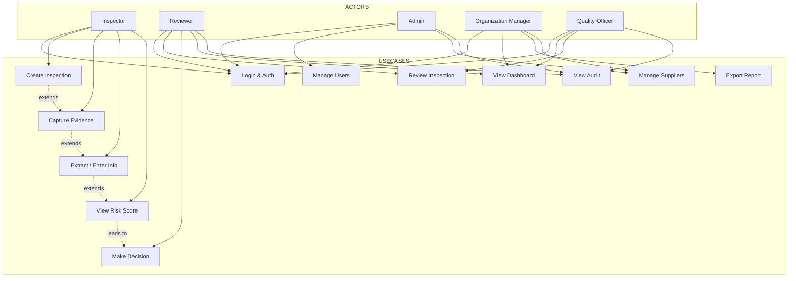

# Use Case Diagram

## Overview

This document summarizes the primary user roles in AuthMed and the main use cases each role performs. It is intended to orient a new engineer or product team member to how the system is used.

## Use Cases Diagram

## Actors & Their Roles

### Inspector
**Primary Goal:** Conduct field inspections and document findings.

**Use Cases:**
- Login & Auth
- Create Inspection
- Capture Evidence (photos, documents, notes)
- Enter batch and condition data
- View preliminary RiskResult

**Success Criteria:**
- Complete inspection within target time
- All evidence uploaded and timestamped
- Data ready for scoring and review

---

### Reviewer
**Primary Goal:** Validate inspection findings and make operational decisions.

**Use Cases:**
- Login & Auth
- Review Inspection
- Make Decision (Accept / Isolate / Escalate)
- View Dashboard and Audit

**Success Criteria:**
- Decisions justified and recorded in AuditLog
- Timely processing of review queue

---

### Admin
**Primary Goal:** System configuration and user management.

**Use Cases:**
- Manage Users and Roles
- Manage Suppliers and Products
- Configure risk thresholds and system settings
- View AuditLog

---

### Organization Manager
**Primary Goal:** Site-level oversight and reporting.

**Use Cases:**
- View Dashboard and KPIs
- Export reports for compliance
- Manage supplier contacts for the organization

---

### Quality Officer
**Primary Goal:** Quality assurance and compliance auditing.

**Use Cases:**
- Review inspections for quality
- Validate reviewer decisions
- Generate compliance reports
- Inspect AuditLog for completeness

---

## Use Case Relationships

- Extends: a basic use case that is extended by more specific cases (e.g., Create Inspection → Capture Evidence).
- Includes: a use case that always includes another (e.g., Make Decision includes View Risk Score).

## Role Matrix

| Use Case | Inspector | Reviewer | Admin | Organization Manager | Quality Officer |
|----------|-----------|----------|-------|----------------------|-----------------|
| Login | ✓ | ✓ | ✓ | ✓ | ✓ |
| Create Inspection | ✓ | - | - | - | - |
| Capture Evidence | ✓ | - | - | - | - |
| Enter Info | ✓ | - | - | - | - |
| View Risk Score | ✓ | ✓ | - | - | ✓ |
| Make Decision | - | ✓ | - | - | ✓ |
| Review Inspection | - | ✓ | - | - | ✓ |
| View Dashboard | - | ✓ | ✓ | ✓ | ✓ |
| Manage Users | - | - | ✓ | - | - |
| Manage Suppliers | - | - | ✓ | ✓ | - |
| View Audit | - | ✓ | ✓ | - | ✓ |
| Export Report | - | - | ✓ | ✓ | ✓ |

---

## Next Steps

See:
1. [Business Workflow](business-workflow.md)
2. [Activity Diagram](activity-diagram.md)
3. [RBAC Matrix](../architecture/rbac-matrix.md)

---

This document is intended for product and engineering onboarding. It summarizes role responsibilities and how use cases map to system functionality.
