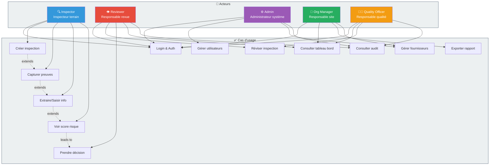

# Use Case Diagram

## Overview

This diagram shows the five main user roles and their interactions with AuthMed, including the key use cases (scenarios) that each role can perform.

## Use Cases Diagram

## Actors & Their Roles

### 🔍 Inspector (Inspecteur Terrain)
**Primary Goal:** Conduct field inspections and document findings  
**Access Level:** Own inspections, own site  

**Use Cases:**
- **Login & Auth** - Access mobile/web app with JWT
- **Create Inspection** - Register incoming batch, assign self
- **Capture Evidence** - Take photos, upload documents, record notes
- **Extract/Saisir Info** - Enter batch details, conditions, observations
- **View Risk Score** - See preliminary risk assessment
- **Mark Complete** - Submit inspection for review

**Success Criteria:**
- Inspection completed within 5 minutes
- All evidence captured
- All notes entered
- Ready for reviewer

---

### 👁️ Reviewer (Responsable Revue)
**Primary Goal:** Validate inspection findings and make approval decisions  
**Access Level:** All inspections in organization  

**Use Cases:**
- **Login & Auth** - Access dashboard
- **View Decision Queue** - See inspections pending review
- **Review Inspection** - Examine evidence, notes, risk score
- **Make Decision** - Accept/Isolate/Escalate with justification
- **View Dashboard** - Monitor KPI and trends
- **View Audit** - Check historical decisions

**Success Criteria:**
- Decision made within 24 hours
- Evidence reviewed thoroughly
- Decision justified with notes
- Audit trail complete

---

### ⚙️ Admin (Administrateur Système)
**Primary Goal:** System configuration and user management  
**Access Level:** Full system access  

**Use Cases:**
- **Login & Auth** - Access admin portal
- **Manage Users** - Create, update, delete users; assign roles
- **Manage Suppliers** - Add/update supplier info
- **Manage Organizations/Sites** - Configure structure
- **View Audit** - Monitor all system activity
- **Configure Rules** - Set risk thresholds, decision logic
- **System Health** - Monitor performance and uptime

**Success Criteria:**
- Users created with correct roles
- Suppliers accurate and current
- System stable and secure
- All changes audited

---

### 🏢 Org Manager (Responsable Site)
**Primary Goal:** Site-level oversight and reporting  
**Access Level:** Own organization/site data  

**Use Cases:**
- **Login & Auth** - Access dashboard
- **View Dashboard** - See KPI for own site(s)
- **Export Report** - Generate compliance/executive reports
- **Manage Suppliers** - Update supplier contacts and performance notes
- **View Metrics** - Trend analysis, acceptance rates, risk distribution
- **Invite Users** - Request new user accounts (creates ticket for Admin)

**Success Criteria:**
- Dashboard visible and accurate
- Reports generated on time
- Trends understood and acted upon
- Staff productivity tracked

---

### 👨‍⚕️ Quality Officer (Responsable Qualité)
**Primary Goal:** Quality assurance and compliance auditing  
**Access Level:** All data, read-mostly with audit rights  

**Use Cases:**
- **Login & Auth** - Access system
- **View Dashboard** - Overall quality metrics
- **Review Inspections** - Audit inspector work quality
- **Validate Decisions** - Spot-check reviewer decisions
- **View Audit** - Complete activity logs for compliance
- **Export Compliance Report** - Generate regulatory reports
- **Identify Trends** - Find systematic issues

**Success Criteria:**
- All inspections traceable
- Decisions justified and consistent
- Compliance requirements met
- No gaps in audit trail

---

## Use Case Details

### Login & Auth (All Roles)
**Scenario:**
1. User opens AuthMed app/portal
2. Enters credentials (username/password)
3. System validates against User database
4. JWT token issued with 24-hour expiry
5. User logged in with their role permissions

**Preconditions:**
- User account exists
- User is marked active
- Password is correct

**Postconditions:**
- JWT token in local storage/secure cookie
- User sees personalized dashboard

**Variations:**
- Forgot password → Email reset link
- Session expired → Re-login required
- Wrong password × 3 → Account locked (15 min)

---

### Create Inspection (Inspector)
**Scenario:**
1. Inspector receives notification of batch arrival
2. Inspector opens AuthMed mobile app
3. Taps "New Inspection"
4. Enters batch details:
   - Batch number
   - Supplier (dropdown)
   - Product (dropdown)
   - Received date/time
   - Received by (auto-fill: self)
5. Selects site/organization
6. Saves batch
7. Status → "Draft"
8. Notification sent to inspector about ready for field

**Preconditions:**
- Inspector logged in
- Organization/site exists
- Supplier exists
- Product exists

**Postconditions:**
- Batch created in system
- Status = "Draft"
- Inspector assigned
- Mobile app shows batch ready for inspection

---

### Capture Evidence (Inspector)
**Scenario:**
1. Inspector arrives at receiving area with batch
2. Opens batch record in mobile app
3. Takes photos:
   - Package exterior
   - Seals/labels
   - Any damage or anomalies
   - Storage area conditions
4. Records short video (optional)
5. Uploads to AuthMed
6. Repeats for multiple photos/angles
7. All evidence timestamped and geotagged (optional)

**Preconditions:**
- Inspection record exists
- Mobile app has camera permission
- Network connectivity available

**Postconditions:**
- Photos uploaded to object storage
- Metadata stored in Evidence table
- Batch status → "Evidence Captured"

---

### Extract Info (Inspector)
**Scenario:**
1. Inspector enters batch condition details:
   - Temperature observed
   - Humidity conditions
   - Physical observations (seal integrity, damage, contamination)
   - Any deviations from expected state
2. Inspector notes any red flags or concerns
3. AuthMed auto-populates product info from reference library
4. Inspector confirms product details match
5. Inspector submits

**Preconditions:**
- Evidence captured
- Product exists in library

**Postconditions:**
- Batch data enriched
- Status ready for scoring

---

### View Risk Score (Inspector)
**Scenario:**
1. Inspector views batch details
2. System displays calculated risk score (0-100)
3. Score breakdown shows:
   - Condition factors (weight %)
   - Observable anomalies (flags)
   - Supplier history factor (weight %)
   - Product risk category factor
4. Preliminary recommendation: Accept/Isolate/Escalate
5. Inspector can request review if score seems wrong

**Preconditions:**
- All batch data entered
- Risk engine has rules configured

**Postconditions:**
- Inspector informed of risk assessment

---

### Make Decision (Reviewer)
**Scenario:**
1. Reviewer logs into dashboard
2. Sees "Decision Queue" with pending inspections
3. Clicks on inspection
4. Reviews:
   - Evidence photos
   - Inspector notes
   - Risk score and reasoning
   - Supplier history
5. Can drill into risk calculation logic
6. Decides: Accept / Isolate / Escalate
7. Adds optional notes/justification
8. Clicks "Submit Decision"
9. System records decision and notifies stakeholders

**Preconditions:**
- Inspection completed by inspector
- Risk score calculated
- Reviewer has reviewer role

**Postconditions:**
- ReviewDecision recorded
- Batch status → "Accepted" / "Isolated" / "Escalated"
- Appropriate team notified

---

### View Dashboard (Manager/Reviewer/Quality Officer)
**Scenario:**
1. User logs into dashboard
2. Dashboard displays real-time KPIs:
   - Total batches today/week/month
   - Acceptance rate (%)
   - Rejection rate (%)
   - Escalation rate (%)
   - Average risk score
   - Trending suppliers/products
3. User can filter by:
   - Date range
   - Supplier
   - Product
   - Site
   - Status
4. User can drill into specific batch
5. Can generate reports

**Preconditions:**
- User has manager/reviewer/quality role
- Data exists in system

**Postconditions:**
- User has visibility into operations
- Can make data-driven decisions

---

## Use Case Relationships

**Extends:** Indicates a basic use case that is extended by more specific cases
- Create Inspection → extends to Capture Evidence → extends to Extract Info → leads to View Risk Score

**Includes:** Indicates a use case that always includes another
- Make Decision includes View Risk Score

**Preconditions/Postconditions:** Define state before and after

---

## Role Matrix

| Use Case | Inspector | Reviewer | Admin | Org Manager | Quality Officer |
|----------|-----------|----------|-------|-------------|-----------------|
| Login | ✓ | ✓ | ✓ | ✓ | ✓ |
| Create Inspection | ✓ | - | - | - | - |
| Capture Evidence | ✓ | - | - | - | - |
| Extract Info | ✓ | - | - | - | - |
| View Risk Score | ✓ | ✓ | - | - | ✓ |
| Make Decision | - | ✓ | - | - | ✓ |
| Review Inspection | - | ✓ | - | - | ✓ |
| View Dashboard | - | ✓ | ✓ | ✓ | ✓ |
| Manage Users | - | - | ✓ | - | - |
| Manage Suppliers | - | - | ✓ | ✓ | - |
| View Audit | - | ✓ | ✓ | - | ✓ |
| Export Report | - | - | ✓ | ✓ | ✓ |

---

## Next Steps

See:
1. [Business Workflow](business-workflow.md) - How use cases flow together
2. [Activity Diagram](activity-diagram.md) - Detailed process steps
3. [RBAC Matrix](../architecture/rbac-matrix.md) - Permission details

---

**Key Insight:** Each role has specific use cases that combine to create the complete inspection workflow. No role can do everything; all are needed for a complete system.
